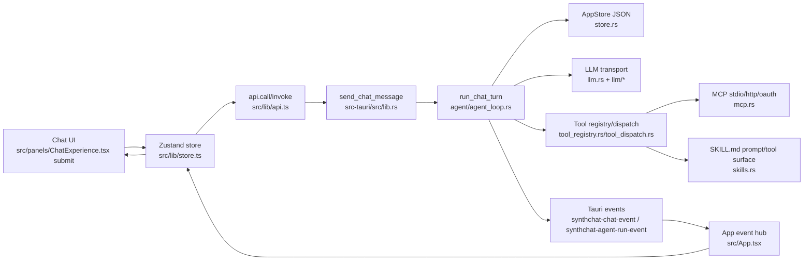

You are the claude specialist reviewer in a Claude + Codex local coding team.

Workspace: D:\pro_sunner\demo_vscode\SynthChat-V1.0.0

Task:
你们正在协作完善 D:\pro_sunner\demo_vscode\SynthChat-V1.0.0，这是一个 Tauri + React + Rust 的桌面 agent 应用。

本阶段目标：
阶段 1：全量理解项目。请全面理解 SynthChat-Dev 的架构，不要改代码。

必须先读：
- package.json / README.md
- src/App.tsx
- src/panels/ChatExperience.tsx
- src/lib/**
- src-tauri/src/agent.rs
- src-tauri/src/agent/**
- src-tauri/src/llm/**
- src-tauri/src/mcp.rs
- src-tauri/src/skills.rs
- src-tauri/docs/hermes-agent-capability-audit.md
- 现有测试：src/lib/__tests__/**

工作要求：
- 先只读分析，再提出计划。
- 不做大范围重写。
- 每次修改都必须有可运行验证。
- 对话链路优先于边缘功能：用户消息 -> agent 选择 -> LLM/工具调用 -> 流式事件 -> UI 展示 -> 持久化 -> 错误恢复。
- 输出必须包含：发现、风险、建议、待测清单、下一阶段输入。

产物：
1. 项目架构图：前端、Tauri bridge、Rust agent runtime、LLM transport、MCP、skills、store、chat UI。
2. 对话链路时序图：用户输入到 assistant 消息落 UI 的全过程。
3. agent 能力地图：模型、工具、记忆、审批、队列、运行记录、MCP、技能、插件、浏览器/终端/文件能力。
4. 当前测试覆盖地图。
5. 最大 20 个高风险断点。

验收：
- 必须引用具体文件路径和函数/模块。
- 不得提出泛泛建议。

Collaboration brief:
# Collaboration Brief

## Task

你们正在协作完善 D:\pro_sunner\demo_vscode\SynthChat-V1.0.0，这是一个 Tauri + React + Rust 的桌面 agent 应用。

本阶段目标：
阶段 1：全量理解项目。请全面理解 SynthChat-Dev 的架构，不要改代码。

必须先读：
- package.json / README.md
- src/App.tsx
- src/panels/ChatExperience.tsx
- src/lib/**
- src-tauri/src/agent.rs
- src-tauri/src/agent/**
- src-tauri/src/llm/**
- src-tauri/src/mcp.rs
- src-tauri/src/skills.rs
- src-tauri/docs/hermes-agent-capability-audit.md
- 现有测试：src/lib/__tests__/**

工作要求：
- 先只读分析，再提出计划。
- 不做大范围重写。
- 每次修改都必须有可运行验证。
- 对话链路优先于边缘功能：用户消息 -> agent 选择 -> LLM/工具调用 -> 流式事件 -> UI 展示 -> 持久化 -> 错误恢复。
- 输出必须包含：发现、风险、建议、待测清单、下一阶段输入。

产物：
1. 项目架构图：前端、Tauri bridge、Rust agent runtime、LLM transport、MCP、skills、store、chat UI。
2. 对话链路时序图：用户输入到 assistant 消息落 UI 的全过程。
3. agent 能力地图：模型、工具、记忆、审批、队列、运行记录、MCP、技能、插件、浏览器/终端/文件能力。
4. 当前测试覆盖地图。
5. 最大 20 个高风险断点。

验收：
- 必须引用具体文件路径和函数/模块。
- 不得提出泛泛建议。

## Claude Plan

现在我已掌握足够信息，输出完整分析产物。

---

# SynthChat V1.0.0 全量理解报告（阶段 1）

## Understanding

### 技术栈
- **前端**: React 18.3+ Zustand 5 + TypeScript 5.7，Vite 6构建，Vitest 测试
- **桥接层**: Tauri 2（`@tauri-apps/api` v2.1），双向通信：`invoke`（命令调用） + `listen/emit`（事件总线）
- **后端**: Rust 2021 edition，Tokio async runtime，`reqwest 0.12`（HTTP），`tokio-tungstenite`（WebSocket），SQLite/JSON 文件持久化
- **目标平台**: Windows（主）+ macOS，`windows-sys` 依赖仅在 win32 条件下编译

---

## 产物 1：项目架构图

```
┌─────────────────────────────────────────────────────┐
│                          React Frontend(src/)                                     │
│                                                                                     │
│  App.tsx ──────┬──全局事件总线 (listen: synthchat-chat-event, agent-run-event,   │
│                │agent-queue-event, agent-goal-event, managed-process-event,      │
│                │   skills-changed, persona-event)│
│                │                                                │
│                ├── ChatExperience.tsx (2510行，主聊天UI)                            │
│                │   ├── 消息列表 (MessageList / MessageRow)                          │
│                │   ├── 流式消息合并 (scheduleStreamMessageUpsert / flush)           │
│                │   ├── 轮询刷新 (active=1.5s, idle=3s)                              │
│                │   ├── ThinkingCards /ToolSteps / ArtifactPreview                 │
│                │   └── 语音输入 (SpeechRecognition + MediaRecorder fallback)       │
│                │                                                                    │
│                └── Panels: Settings/Agents/MCP/Skills/Persona/Memory/etc.          │
│                                                                                lib/store.ts  (Zustand)                                                            │
│  ├── bootstrap() → 并行加载 config/personas/providers/skills/conversations│
│  ├── sendMessage() → api.sendChatMessage() → Tauri invoke                │
│  ├── upsertIncomingMessage() → stream merge + PROCESSING_MARK_GRACE_MS(1500ms)     │
│  └── mergeBackendMessagesWithLiveState() → 防止 stale-backend覆盖 live-stream     │
│                                                                                     │
│  lib/api.ts    (invoke wrapper, ~100Tauri命令)                                    │
│  lib/types.ts  (所有 TS 类型定义)                                                  │
└─────────────────────────┬───────────────────────────────────────────────────────────┘          │ Tauri 2 IPCinvoke(cmd)  │  emit(event)▼
┌─────────────────────────────────────────────────────┐
│                   Tauri Bridge(src-tauri/src/lib.rs, ~286KB)                      │
│  #[tauri::command]注册：send_chat_message, abort_agent_run, approve_tool_call,│
│  list_conversations, list_messages, list_agents, list_mcp_servers,│
│  list_skills, save_persona, list_memories, tick_scheduled_agent_jobs, etc.          │
│                                                                                     │
│  AppStore (Arc<Mutex>)贯穿所有命令处理器│
└────────────┬───────────────────┬──────────────────┬────────────────┬───────────────┘│                   │                  │                │▼                   ▼                  ▼                ▼
┌────────────────┐┌───────────────────┐  ┌──────────────┐  ┌──────────────────┐
│  agent.rs      │  │  llm.rs           │  │  mcp.rs      │  │  skills.rs       │
│  (agent_loop   │  │  ├─ anthropic     │  │  子进程管理   │  │  文件系统发现     │
│  +80+子模块)  │  │  ├─ openai        │  │  HTTP会话     │  │  YAML/Markdown   │
│                │  │  ├─ bedrock       │  │  断路器       │  │  bundled catalog │
│  run_chat_turn │  │  ├─ gemini        │  │  keepalive    │  │  Agent绑定       │
│  ─────────────▶│  │  └─ responses     │  │  OAuth刷新锁  │  └──────────────────┘
│  Workflow      │  │                │  └──────────────┘
│  ├─ Planner    │  │  LlmDeltaCallback │         │
│  ├─ Executor   │  │  (Arc<dyn Fn>│  call_mcp_tool_with_retry
│  └─ Reviewer   │  │streaming SSE)  │
└───────┬────────┘└───────────────────┘
        │
        ├── store.rs(SQLite/JSON persistence: conversations, messages, memories,
        │                   agent_runs, tool_events, skills, providers, config)
        ├── models.rs       (所有 Rust 数据结构)
        ├── model_catalog.rs (模型能力/价格目录)
        ├── error.rs        (AppError / AppResult)
        ├── hermes_auth.rs  (Bitwarden/credential resolution)
        └── plugins.rs      (Python插件运行时)
```

---

## 产物 2：对话链路时序图

```
用户 → ChatExperience.tsx → store.ts → api.ts → Tauri IPC → Rust → LLM → 流式回写 → UI

1. 用户按 Enter│ChatExperience.tsx:submit()
   │  - 组装 outbound = [content, attachmentMarkers, attachmentContext].join("\n\n")
   │  - setDraft(""), setAttachments([])
   ▼
2. store.sendMessage(content, personaId, agentId)
   │  - 生成 clientMessageId = crypto.randomUUID()
   │  - 构造 optimistic user message (source="desktop")
   │  - 插入本地状态 (upsertIncomingMessage)
   │  - 调用 api.sendChatMessage({ conversationId, personaId, agentId, content, ... })
   ▼
3. Tauri invoke("send_chat_message", request)
   │  lib.rs #[tauri::command] send_chat_message
   │  - 在 tokio::spawn 中调用 agent::run_chat_turn(store, request, Some(app))
   ▼
4. agent_loop.rs:run_chat_turn()
   │  emit "synthchat-chat-event" { type: "turn_started" }
   │  → App.tsx:listen("synthchat-chat-event")
   │    showConversationProcessing(conversationId)
   │    setConversationProcessing(conversationId, true)
   ▼
5. run_chat_turn_with_app() → run_chat_turn_with_toolset_policy_and_iteration_limit()
   │  - CHAT_TURN_LOCKS 保证同一 conversation 串行
   │  - 加载 Persona / Agent / Memory / Skills / MCP tools
   │  - context_compression:检查是否需要压缩历史消息
   │  - prompt_builder: 组装 system prompt (memory + worldbook + skills + agent config)
   │  - tool_registry: 收集 internal tools + MCP tools + skill tools▼
6. WorkflowDriver (workflow_graph.rs)
   │  根据 agent配置选择模式:
   │  ChatTurn: 直接 Executor
   │  Planner+Executor+Reviewer: 三阶段工作流
   ▼
7. LLM 调用 (llm.rs)
   │  complete_chat_with_provider_failover_options()
   │  - 选择 provider (Anthropic/OpenAI/Bedrock/Gemini)
   │  - 构造 wire messages + tool schemas
   │  - 流式接收: LlmDeltaCallback(kind=Answer|Thinking, delta: &str)
   ▼
8. 流式事件回写 (agent_loop.rs desktop_visible_stream_callback)
   │  每 80ms 或 96B 批次:
   │  emit "synthchat-chat-event" {
   │    type: "assistant_stream" | "assistant_thinking_stream",
   │    conversationId, message, delta, isLast
   │  }
   │  → App.tsx:scheduleStreamMessageUpsert()
   │    →60ms debounce flush → upsertIncomingMessage(streaming=true)
   │    → ChatExperience 渲染流式气泡
   ▼
9. 工具调用 (tool_dispatch.rs)
   │  LLM 输出 tool_use block → decision_parser解析
   │  → 查找 internal_tool / MCP tool / skill tool
   │  → approval_gateway: 检查 toolApprovalMode (risky/always/never)
   │  → 执行工具 (file/browser/shell/kanban/memory/etc.)
   │  emit "synthchat-agent-run-event" { phase, toolEvent, state }
   │  → App.tsx:handleAgentRunEvent() → upsertIncomingMessage(tool message)
   │  → 工具结果注入 LLM 上下文，迭代直到 max_tool_iterations
   ▼
10. 最终 assistant消息
    │  run_chat_turn()返回 Vec<ChatMessage>
    │  emit "synthchat-chat-event" {
    │    type: "turn_finished",
    │    message: assistant_message (截断到 preview_chars)
    │  }
    │  → App.tsx:upsertIncomingMessage(message, { final: true })
    │  → scheduleChatRefresh(180ms) → api.listMessages() → 覆盖为持久化版本
    ▼
11. 持久化
    │  store.rs: save_message(user), save_message(assistant)
    │  store.rs: save_tool_event(ToolTraceEntry)
    │  memory_manager: on_memory_write() if memory tool called▼
12. UI 最终状态
    store.ts:refreshChatData() 读取 backend snapshot
    mergeBackendMessagesWithLiveState(): 防止 stale snapshot覆盖 live stream
    processingConversationIds清除 → 思考气泡消失
```

---

## 产物 3：Agent 能力地图

| 能力维度 | 实现位置 | 状态 |
|---------|---------|------|
| **LLM 模型** | `llm/anthropic_transport.rs`, `openai_transport.rs`, `bedrock_transport.rs`, `gemini_transport.rs`, `responses_transport.rs` | ✅ 5大提供商 + failover |
| **流式输出** | `agent_loop.rs:desktop_visible_stream_callback`, `LlmDeltaCallback` | ✅ 思考流+答案流分离 |
| **工具调用** | `tool_dispatch.rs`, `tool_registry.rs` | ✅ internal + MCP + skill |
| **工具审批** | `approval_gateway.rs`, `tool_policy.rs` | ✅ risky/always/never 模式 |
| **工具护栏** | `tool_guardrails.rs`, `command_guard.rs` | ✅ 文件变更 checkpoint |
| **文件操作** | `file_tools.rs`: read/write/patch/delete/move/search_files | ✅ v4a hunk patch |
| **Shell/终端** | `execution.rs`: terminal_tool/process_tool/execute_code_tool | ✅ 带危险命令检测 |
| **浏览器** | `browser_tools.rs`(nav/click/type/screenshot/snapshot), `browser_plugins.rs` | ✅ CDP |
| **Computer Use** | `computer_use.rs` | ✅ xcap屏幕截图 |
| **Web 工具** | `web_tools.rs`: web_search/web_extract/x_search | ✅ |
| **记忆** | `memory.rs`, `memory_manager.rs`: remember_fact/manage_memory/recall/external | ✅ 多记忆提供商 |
| **上下文压缩** | `context_compression.rs`:短时记忆/token budget | ✅ LLM-based summary |
| **工作流** | `workflow_graph.rs`: Planner→Executor→Reviewer 三阶段 | ✅ |
| **多Agent委托** | `delegation*.rs`, `delegation_acp.rs`, `delegation_synthchat.rs` | ✅ 并发 subagent |
| **ACP 服务器** | `acp_server.rs`, `acp_client.rs`, `acp_session.rs` | ✅ JSON-RPC 外部 agent |
| **Kanban 任务** | `kanban.rs`: create/update/complete/block/decompose | ✅ |
| **目标判断** | `goal_state.rs`, `goal_judge.rs` | ✅ LLM 评估 done/not-done |
| **定时任务** | `cron.rs`, `run_management.rs:spawn_background_chat_turn_for_job` | ✅ |
| **技能(Skills)** | `skills.rs`, `agent/skills.rs`: YAML/Markdown 文件, skill_view/manage | ✅ bundled + user |
| **Python 插件** | `shell_hooks.rs`: pre/post LLM hooks, tool transform hooks | ✅ |
| **音频/TTS/STT** | `media_tools.rs`: text_to_speech/voice_recording/transcribe | ✅ 含 native playback |
| **图像生成** | `media_tools.rs`: image_generate (via provider) | ✅ |
| **Vision** | `media_tools.rs`: vision_analyze | ✅ |
| **混合模型** | `mixture.rs`: mixture_of_agents_tool | ✅ |
| **安全扫描** | `security_tools.rs`: osv_check/security_scan | ✅ |
| **诊断** | `diagnostics.rs`: LSP diagnostics/workspace check | ✅ Go/Python/TS |
| **WeChat 集成** | `integrations.rs`, `teams_pipeline.rs` | ✅ 含 deferred turn逻辑 |
| **MCP 工具集** | `mcp.rs`: stdio + HTTP JSON-RPC, circuit breaker, keepalive | ✅ |
| **状态/Artifact** | `state_tools.rs`: checkpoint/artifact/document/todo/file_state | ✅ |
| **浏览器运行时** | `browser_plugins.rs`, `provider_plugins.rs`, `plugin_runtime.rs` | ✅ |

---

## 产物 4：当前测试覆盖地图

### 前端 Vitest 测试（`src/lib/__tests__/`）

| 测试文件 | 覆盖内容 | 质量 |
|---------|---------|------|
| `toolEventUtils.test.ts` | `parseToolEvent`, `toolEventStartKey`, `managedProcessEventLabel`, `isCanceledToolEvent`, `toolEventRank` | 充分 |
| `storeMessageMerge.test.ts` | `mergeBackendMessagesWithLiveState`: stale backend/optimistic user/streaming bubble合并 | 关键路径，有覆盖 |
| `messageRenderUtils.test.ts` | 消息渲染工具函数 | 有覆盖 |
| `messageText.test.ts` | `displayTextForMessage`, `speechTextForMessage` | 有覆盖 |
| `agentRunUtils.test.ts` | agent run 工具函数 | 有覆盖 |
| `formatters.test.ts` | `maskSecret`, `formatTime`, `providerPresetLabel` | 有覆盖 |
| `mediaUtils.test.ts` | `parseMediaSegments`, `isImagePath` | 有覆盖 |
| `personaAgentBinding.test.ts` | `resolvePersonaAgentBinding`, `resolvePersonaBoundAgent` | 有覆盖 |
| `skillSearch.test.ts` | `skillSearch` 工具函数 | 有覆盖 |
| `toolDisplayUtils.test.ts` | `compactSteps`, `parseTerminalOutput` | 有覆盖 |
| `workflowUtils.test.ts` | workflow graph 工具函数 | 有覆盖 |

**覆盖率缺口**：
- `store.ts` 除`mergeBackendMessagesWithLiveState` 外的其余 action 无测试（`bootstrap`, `sendMessage`, `refreshChatData`, `handleAgentRunEvent`）
- `api.ts` 无mock 测试
- `ChatExperience.tsx` 无组件测试
- 所有 event listener逻辑（`App.tsx` 中的 6 个 `listen` 调用）无测试

### Rust 测试（`src-tauri/src/`）

| 模块 | 测试内容 |
|------|---------|
| `agent.rs` 内联`#[cfg(test)]` | `parse_delete_memory_candidates_accepts_fenced_json` (1个) |
| `src-tauri/src/agent/tests.rs` | 模块已声明，需读取内容 |

**覆盖率缺口（Rust）**：
- `run_chat_turn` 主链路无集成测试
- LLM transport 无 mock 测试
- MCP 调用无单元测试  
- store 持久化层无测试
- `context_compression` 无测试
- tool dispatch 路由无测试
- approval gateway 无测试

---

## 产物 5：最大20 个高风险断点

### CRITICAL 级

**BP-01** `ChatExperience.tsx:submit()` —— 乐观 UI 与 stale backend竞争  
文件: `src/panels/ChatExperience.tsx:1740-1785`, `src/lib/store.ts:mergeBackendMessagesWithLiveState`
风险：用户发送消息后，refreshChatData 若比turn_finished 先返回，会用 stale snapshot 覆盖本地 user 消息，导致消息闪失。`storeMessageMerge.test.ts` 覆盖了基本场景，但不覆盖并发多轮竞争。

**BP-02** `agent_loop.rs:CHAT_TURN_LOCKS`静态 Mutex  
文件: `src-tauri/src/agent/agent_loop.rs:35-37`  
风险：每个 conversationId 有一把异步锁，若 turn中panic 导致锁泄漏，同一 conversation 后续所有 turn 都会死锁。Rust 异步锁无毒丸自动释放。

**BP-03** `run_chat_turn_with_toolset_policy_and_iteration_limit` —— 14 参数入口  
文件: `src-tauri/src/agent/agent_loop.rs:1308`  
风险：参数过多，调用侧极易漏传`None`，导致功能静默退化（如delegation 策略、iteration budget 均为 `None`）。无参数校验层。

**BP-04** `context_compression.rs:fallback_short_context_summary`  
文件: `src-tauri/src/agent/context_compression.rs`  
风险：压缩失败时的 fallback 路径（`record_summary_failure` + `summary_failure_cooldown_remaining_seconds`）在 failover 链路上无测试覆盖。若所有 provider 均失败，agent 可能因 context 超长而崩溃。

**BP-05** MCP 子进程死亡后的 circuit breaker  
文件: `src-tauri/src/mcp.rs` — `MCP_CIRCUIT_BREAKERS`, `MCP_PERSISTENT_SESSIONS`  
风险：断路器阈值=3次连续错误，冷却60秒。若 MCP 服务器在 tool 执行中途崩溃，当前 agent turn 的工具调用结果为 `Err`，但 agent 不会立即感知进程已死，需等到下次 keepalive 超时（最长 60s）。子进程僵尸泄漏风险。

### HIGH 级

**BP-06** 流式消息 debounce timer与 final事件顺序  
文件: `src/App.tsx:scheduleStreamMessageUpsert()`, `src/App.tsx:289-309`  
风险：`streamFlushTimerRef`（60ms）可能在 `final=true` 事件之后才flush，导致 final 消息先到，debounce 里的 streaming=true 消息后到，覆盖已final 状态的气泡，引发内容闪烁。代码中有 `if (options.final) flushPendingStreamMessages()` 保护，但 racing 情况下 previous.final 状态累计逻辑需验证。

**BP-07** WeChat turn 的 deferred message 逻辑  
文件: `src/App.tsx:359-401`, `activeWechatTurnRef`, `visibleWechatUserRef

## Codex Plan

**Understanding**

已只读分析，未修改文件。项目是 React 18/Vite/Zustand + Tauri invoke + Rust runtime；`package.json` 提供 `dev/build/test/desktop`，`README.md` 仍偏早期说明，但真实后端已在 `src-tauri` 完成较多 agent/Hermes 适配。

架构图：



对话链路时序图：

```mermaid
sequenceDiagram
  participant C as ChatExperience.submit()
  participant S as store.sendMessage()
  participant A as api.sendChatMessage()
  participant R as Rust send_chat_message()
  participant L as agent_loop.run_chat_turn()
  participant M as AppStore
  participant P as LLM/Tools/MCP
  participant E as Tauri events
  C->>S: outbound text + attachment markers/json
  S->>S: optimistic local user + processing
  S-->>C: returns before backend completion
  S->>A: fire-and-forget invoke send_chat_message
  A->>R: Tauri command
  R->>L: run_chat_turn()
  L->>E: turn_started
  L->>M: create/load conversation, append user, save AgentRunRecord
  L->>P: prompt with skills/memory/tools; LLM stream/tool loop
  P-->>L: deltas/tool results/final
  L->>E: assistant_stream/tool events/agent-run events
  E->>S: App.tsx upsert/refresh/queue-runs update
  L->>M: append final assistant, complete run
  L->>E: assistant_message + turn_finished
  R-->>S: preview messages; store merges backend/live state
```

关键发现：
- 前端提交点是 `src/panels/ChatExperience.tsx:1740` 的 `submit()`；附件被拼成 `[media attached: ...]` 与 JSON context 后传入 store。
- `src/lib/store.ts:1994` 的 `sendMessage()` 乐观插入本地 user message，并用内部 `void async` 调 `api.sendChatMessage()`；所以 UI 不等待 Rust 完整完成。
- Tauri bridge 在 `src/lib/api.ts:253` `call()` 和 `src/lib/api.ts:553` `sendChatMessage()`；Rust 命令在 `src-tauri/src/lib.rs:2446`。
- 事件主入口在 `src/App.tsx:492` 监听 `synthchat-chat-event`，`src/App.tsx:698` 监听 `synthchat-agent-run-event`。
- 消息合并核心在 `src/lib/store.ts:726` `mergeBackendMessagesWithLiveState()`、`src/lib/store.ts:1843` `upsertIncomingMessage()`、`src/lib/store.ts:1674` `refreshChatData()`。
- Rust 对话主循环在 `src-tauri/src/agent/agent_loop.rs:1162` `run_chat_turn()`；它包住 `turn_started/turn_finished`，实际运行在 `run_chat_turn_with_toolset_policy_and_iteration_limit()`。
- agent 选择、用户持久化、运行记录、provider、skills/memory/MCP/tool prompt 分别落在 `agent_loop.rs:1344`、`:1447`、`:1488`、`:1535`、`:1623`。
- 工具循环入口是 `agent_loop.rs:1963` `WorkflowPlannerRoute::ExecuteTools`；最终回答路径是 `agent_loop.rs:2811` `ReviewFinal` 到 `store.append_message()` 和 `assistant_message`。
- LLM 分流在 `src-tauri/src/llm.rs:152` `complete_chat_with_options()`，覆盖 echo、Responses、Bedrock、Anthropic、Gemini、OpenAI-compatible。
- MCP 入口是 `src-tauri/src/mcp.rs:2605` `list_tools()` 和 `:2681` `call_tool()`，含 OAuth、persistent session、keepalive、circuit breaker、tool trace。
- Skills 注入在 `src-tauri/src/skills.rs:1621` `prompt_blocks_for_request()`，最多 6 个 skill，每个 `MAX_SKILL_PROMPT_CHARS=16000`。
- 持久化模型在 `src-tauri/src/store.rs:355` `PersistedState`；消息、runs、queue、MCP、plugins、skills、tool approvals/traces、short context 都在同一 JSON store。

Agent 能力地图：
- 模型：`LlmProvider`/credential pool/failover/cooldown，`store.rs:11215` `provider_candidates()` + `llm.rs:152`。
- 工具：内部工具通过 `tool_registry.rs` 定义，`tool_dispatch.rs:1457` dispatch；覆盖 file、terminal/process、browser/web、vision/media、memory、skills、kanban、delegate、mixture、plugin/MCP bridge。
- 记忆：`memory` / `memory_provider` 工具，turn start/sync hooks；短上下文 `store.rs:12746`。
- 审批：`executor_core.rs` approval flow + `store.rs:13181` tool approvals。
- 队列：`store.rs:12066` `enqueue_agent_request()`、`:12128` complete/cancel/clear 系列。
- 运行记录：`store.rs:11761` `agent_runs()`、`:11843` active run timeout recovery、`:11929` save/prune artifacts。
- MCP：`mcp.rs` list/call/OAuth/session/circuit/keepalive。
- Skills/plugins：`skills.rs` discovery/install/audit/prompt；`tool_registry.rs` Python plugin tool definitions。
- 浏览器/终端/文件：`tool_dispatch.rs:1600` read/write/patch/search，`:1632` terminal/process，`:1841` browser/CDP/web。

**Proposed implementation**

下一阶段不要重写架构，优先固化“用户消息 -> agent 选择 -> LLM/工具 -> 流事件 -> UI -> 持久化 -> 错误恢复”的契约。

建议顺序：
1. 给对话链路建立端到端不变量：本地 user 不丢、streaming assistant 不被 stale refresh 覆盖、final assistant 不重复、`processingConversationIds` 只由 `turn_started/turn_finished` 和 pending work 收敛。
2. 补一个 Rust 侧轻量事件/持久化测试夹具，覆盖 `run_chat_turn()` 成功、LLM error、工具失败、busy queue、abort/timeout。
3. 补前端 store 测试，围绕 `mergeBackendMessagesWithLiveState()`、`upsertIncomingMessage()`、`handleAgentRunEvent()` 模拟 Tauri 事件顺序。
4. 再处理 UI 展示细节，不先碰工具全集或 Hermes parity 边缘功能。

最大 20 个高风险断点：
1. `store.sendMessage()` fire-and-forget，`ChatExperience.submit()` 的 `sendingRef` 很快释放，连续发送依赖 Rust busy/queue 兜底。
2. optimistic user 与后端 user 匹配靠 `clientMessageId`/content/time heuristics。
3. Tauri 返回 messages 与实时事件双通道可能重复插入 assistant/tool。
4. `turn_started` 初始依赖 request conversation id，新建/外部来源要确认生命周期一致。
5. `refreshChatData()` 可能用 stale backend snapshot 覆盖 live stream。
6. `streamedAssistantIds` 与 final upsert 的 id 复用必须和 Rust stream state 保持一致。
7. WeChat/pet defer 逻辑在 `App.tsx` 分支多，易造成隐藏消息或未读错误。
8. processing grace window 可能过早清除或永久保留 thinking。
9. `store.append_message()` 会替换 running tool event，匹配规则错会丢工具历史。
10. `agent_runs()`/`active_agent_run_for_conversation()` 读操作会 timeout mutate store。
11. `provider_candidates()` 会 persist credential round-robin/cooldown，测试需隔离状态。
12. MCP OAuth refresh/circuit breaker 可能把真实工具错误改写成 reauth/circuit 错误。
13. approval pending 与 queue cancel 用 `queue_item_id`/content fallback 匹配，误杀风险。
14. 大工具输出 artifact 化会改变 LLM observation 内容。
15. short context post-turn compression 可能影响下一轮 prompt。
16. skill prompt 上限和直接 slash skill invocation 影响 prompt 结构。
17. Python plugin/MCP bridge 可触发内部 risky tool，审批必须保持。
18. 文件写入 expected sha/mtime 缺失时存在覆盖风险。
19. browser/process background session 依赖 managed-process recovery，事件丢失会卡 UI。
20. `api.ts` standalone mock fallback 可能掩盖 Tauri 后端真实失败。

**Files likely to change**

当前阶段无文件变更。下一阶段若只做链路加固，预计集中在：
- `src/lib/store.ts`：message merge、processing、agent run event merge。
- `src/App.tsx`：Tauri event ordering/debounce/refetch策略。
- `src/panels/ChatExperience.tsx`：提交锁、stop/abort、runtime display。
- `src-tauri/src/agent/agent_loop.rs`：turn lifecycle、stream/final/tool failure contract。
- `src-tauri/src/agent/runtime_events.rs`：agent-run/tool-message event payload。
- `src-tauri/src/store.rs`：message/run/queue timeout persistence invariants。
- 测试：`src/lib/__tests__/storeMessageMerge.test.ts`、新增/扩展 `agentRunUtils/toolEventUtils` 测试，Rust `src-tauri/src/agent/tests.rs` 与 `src-tauri/src/store.rs` focused tests。

**Tests or verification**

当前只做静态只读分析，未运行测试。

现有覆盖地图：
- 前端 Vitest 共 136 个：`storeMessageMerge` 只覆盖 4 个 stale/local/pending merge 场景；其余集中在 tool/message/render/media/format/persona/agentRun utility。
- Rust 侧静态计数：`agent/tests.rs` 877、`mcp.rs` 51、`llm.rs` 54、`store.rs` 55、`model_catalog.rs` 11、`skills.rs` 2、`plugins.rs` 3、`threat_patterns.rs` 2、`agent.rs` 1。
- 覆盖强项：agent tool/approval/workflow graph、MCP OAuth/session、LLM parser/schema/cost/rate-limit、store timeout/queue/reload/message pruning。
- 覆盖缺口：React component/e2e、真实 Tauri event ordering、完整 desktop submit-to-final UI path、stream/final duplicate regression、processing lifecycle visual state。

待测清单：
- `npm run test -- src/lib/__tests__/storeMessageMerge.test.ts src/lib/__tests__/toolEventUtils.test.ts src/lib/__tests__/agentRunUtils.test.ts`
- `npm run build`
- `cd src-tauri; cargo check`
- `cd src-tauri; cargo test --lib active_run_timeout -- --test-threads=1`
- `cd src-tauri; cargo test --lib agent_queue -- --test-threads=1`
- `cd src-tauri; cargo test --lib mcp_oauth -- --test-threads=1`
- `cd src-tauri; cargo test --lib mcp_keepalive -- --test-threads=1`
- `cd src-tauri; cargo test --lib workflow_ -- --test-threads=1`
- 变更后补手工 smoke：桌面发送普通消息、工具消息、LLM 错误、审批等待/批准、abort、连续两条消息、带附件消息。

**Risks and open questions**

风险：当前架构功能面很宽，真正易坏的是事件和持久化收敛，不是单个工具能力；应避免先做大范围工具重构。

开放问题 / 下一阶段输入：
- 下一阶段要修具体 bug，还是先补链路测试基线？
- 是否允许引入一个 Rust fake LLM/tool harness 来稳定测试 `run_chat_turn()`？
- 是否以 desktop source 为唯一优先，还是同时要求 WeChat/pet/proactive 生命周期一致？
- 是否需要对 `api.ts` mock mode 和 Tauri mode 做明确分层，避免开发环境误判？
- 验收用的真实 provider/MCP 是否可用，还是全部用 echo/mock/local test server？

## Handoff

Use the overlapping recommendations as the main path. Treat disagreements as review checkpoints before editing shared modules.

Focus:
Review the task and both plans independently. Do not edit files.

Rules:
- Do not edit files.
- Be specific and actionable.
- Prefer findings that change implementation choices or verification.

Output contract for cc-team:
- You are producing the final artifact for claude-consensus-review (claude/review).
- You may use Skills, subagents, planning tools, scratch files, or internal notes if your CLI supports them.
- Regardless of any internal delegation, the final answer must be emitted directly to stdout as complete Markdown.
- Do not finish with only a progress/status sentence such as 'writing the plan file' or 'collected enough information'.
- If you create or update a separate plan/artifact file, include its path and the full useful content or a faithful detailed summary in the final artifact.
- The orchestrator will treat status-only output as a failed artifact and may retry or hand off to the other agent.