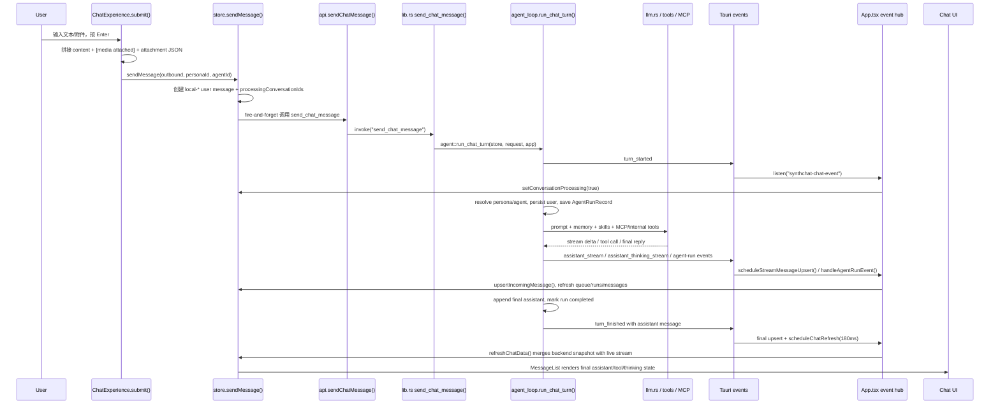

# SynthChat 阶段 1 最终综合产物

范围：只读分析 `.multi-agent/runs/.../claude-plan.md`、`codex-plan.md`、`collaboration-brief.md`，并核查关键源码。未修改任何项目文件，未运行测试。

## 1. 项目架构图

```mermaid
flowchart LR
  UI[Chat UI<br/>src/panels/ChatExperience.tsx<br/>submit():1740<br/>MessageList/MessageRow/ThinkingCards/ToolSteps] --> Store[Zustand Store<br/>src/lib/store.ts<br/>bootstrap():1490<br/>sendMessage():1994<br/>refreshChatData():1674<br/>upsertIncomingMessage():1843]
  Store --> API[Frontend API Bridge<br/>src/lib/api.ts<br/>isTauri():249<br/>call():253<br/>sendChatMessage():554]
  API --> Tauri[Tauri Bridge<br/>src-tauri/src/lib.rs<br/>send_chat_message():2446<br/>invoke_handler():7753]
  Tauri --> Runtime[Rust Agent Runtime<br/>src-tauri/src/agent.rs<br/>agent_loop.rs run_chat_turn():1162<br/>workflow_graph.rs<br/>executor_core.rs<br/>tool_dispatch.rs]
  Runtime --> RustStore[Persistence Store<br/>src-tauri/src/store.rs<br/>PersistedState:355<br/>append_message():10204<br/>agent_runs():11761<br/>enqueue_agent_request():12066]
  Runtime --> LLM[LLM Transport<br/>src-tauri/src/llm.rs<br/>complete_chat_with_options():152<br/>anthropic/openai/bedrock/gemini/responses]
  Runtime --> MCP[MCP Runtime<br/>src-tauri/src/mcp.rs<br/>list_tools():2605<br/>call_tool():2681<br/>OAuth/session/circuit/keepalive]
  Runtime --> Skills[Skills<br/>src-tauri/src/skills.rs<br/>prompt_blocks_for_request():1621<br/>agent/skills.rs skill_view/skill_manage]
  Runtime --> Tools[Tool Surface<br/>agent/tool_registry.rs<br/>agent/tool_dispatch.rs:1432<br/>file/browser/terminal/memory/media/delegate/plugin]
  Runtime --> Events[Tauri Events<br/>synthchat-chat-event<br/>synthchat-agent-run-event]
  Events --> AppHub[Event Hub<br/>src/App.tsx<br/>chat listener:492<br/>agent-run listener:698<br/>queue/process/skills listeners]
  AppHub --> Store
  Store --> UI
```

关键发现：`README.md` 仍称 `src/lib/api.ts` 是 Mock API，但真实代码已通过 `src/lib/api.ts:249-253` 自动选择 Tauri `invoke()`，并由 `src-tauri/src/lib.rs:2446` 接入 Rust agent；README 是滞后文档，不是当前架构事实。

## 2. 对话链路时序图



落点：
- 前端提交：`src/panels/ChatExperience.tsx:1740` `submit()`。
- 乐观插入：`src/lib/store.ts:1994` `sendMessage()`。
- IPC：`src/lib/api.ts:554` `sendChatMessage()` -> `src-tauri/src/lib.rs:2446` `send_chat_message()`。
- Agent 主循环：`src-tauri/src/agent/agent_loop.rs:1162` `run_chat_turn()`，实际执行入口 `run_chat_turn_with_toolset_policy_and_iteration_limit():1308`。
- 流式桥：`agent_loop.rs:335` `desktop_visible_stream_callback()`，事件由 `src/App.tsx:492` 消费。
- 最终消息：`agent_loop.rs:2811` `WorkflowPlannerRoute::ReviewFinal`，`store.rs:10204` `append_message()`，前端 `store.ts:1843` `upsertIncomingMessage()`。

## 3. Agent 能力地图

| 能力 | 当前实现 |
|---|---|
| 模型 | `src-tauri/src/llm.rs:152` 分派 echo、Responses、Bedrock、Anthropic、Gemini、OpenAI-compatible；子模块在 `src-tauri/src/llm/*_transport.rs`。 |
| 工具 | `src-tauri/src/agent/tool_registry.rs` 定义可见工具，`tool_dispatch.rs:1432` 执行 internal/MCP/tool_call bridge。 |
| 记忆 | `agent/memory.rs`、`agent/memory_manager.rs`，turn start 注入见 `agent_loop.rs:1623` 附近 memory/skills/tool prompt 装配。 |
| 审批 | `agent/tool_policy.rs`、`agent/approval_gateway.rs`，持久化在 `store.rs:13173` `tool_approvals()`、`:13181` `append_tool_approval()`。 |
| 队列 | `store.rs:12066` `enqueue_agent_request()`，前端 `store.ts:2548` `refreshAgentQueue()`，事件 `App.tsx:724`。 |
| 运行记录 | `store.rs:11761` `agent_runs()`，`runtime_events.rs:207` 发 `synthchat-agent-run-event`，前端 `store.ts:2556` 合并。 |
| MCP | `mcp.rs:2605` `list_tools()`，`:2681` `call_tool()`，包含 OAuth、persistent session、circuit breaker、keepalive。 |
| 技能 | `skills.rs:1621` `prompt_blocks_for_request()` 最多选择 6 个 skill；agent 侧 `agent/skills.rs` 提供 `skill_view` / `skill_manage`。 |
| 插件 | `agent/plugin_runtime.rs`、`agent/provider_plugins.rs`、`agent/shell_hooks.rs`，Hermes 审计记录见 `src-tauri/docs/hermes-agent-capability-audit.md:37-38`。 |
| 浏览器 | `agent/browser_tools.rs`，UI 状态命令在 `api.ts:759` `browserRuntimeStatus()`；Hermes 审计 `browser tools` 见 audit `:39`。 |
| 终端/进程 | `agent/execution.rs:68` `terminal_tool()`、`:1040` `process_tool()`，前端 managed process 事件在 `App.tsx:757`。 |
| 文件 | `agent/file_tools.rs:168` `read_file_tool()`、`:855` `search_files_tool()`、`:946` `write_file_tool()`，审计明确含 patch/delete/move 与 sha/mtime 安全。 |
| Store | `store.rs:355` `PersistedState` 聚合 config、messages、providers、runs、queue、MCP、plugins、skills、approvals、tool traces、short_context。 |

## 4. 当前测试覆盖地图

前端 Vitest：`src/lib/__tests__` 共 11 个测试文件，主要覆盖纯函数。
- `storeMessageMerge.test.ts`：4 个核心场景，覆盖 stale backend、本地 user 替换、wechat live message、inactive conversation pending。
- `toolEventUtils.test.ts`：15 个，覆盖 tool event 解析、key、label、cancel/rank。
- `agentRunUtils.test.ts`：23 个，覆盖 run/queue label、duration、terminal state、agent label。
- 其余：`messageText` 17、`messageRenderUtils` 17、`mediaUtils` 12、`formatters` 12、`toolDisplayUtils` 12、`personaAgentBinding` 11、`skillSearch` 9、`workflowUtils` 4。

Rust 测试：静态计数显示 `src-tauri/src/agent/tests.rs` 有 860 个 `#[test]`/`#[tokio::test]`，另有 `mcp.rs` 51、`llm.rs` 54、`store.rs` 55、`model_catalog.rs` 11、`skills.rs` 2、`plugins.rs` 3、`threat_patterns.rs` 2、`agent.rs` 1。代表性覆盖包括 tool approval、workflow graph、queue、active run timeout、context compression、MCP OAuth/keepalive、LLM parser/tool calls、terminal/browser/media/diagnostics。

缺口：
- 无 `ChatExperience.tsx` / `App.tsx` React 组件级事件顺序测试。
- `store.ts` 除 `mergeBackendMessagesWithLiveState()` 外，`sendMessage()`、`refreshChatData()`、`upsertIncomingMessage()`、`handleAgentRunEvent()` 缺少完整事件序列测试。
- 真实 Tauri event ordering、stream/final duplicate、desktop submit-to-final UI path 缺 e2e。
- Hermes audit `src-tauri/docs/hermes-agent-capability-audit.md:11` 明确 full `cargo test` 被延后到 release hardening，当前依赖 focused tests。

## 5. 最大 20 个高风险断点

1. `ChatExperience.tsx:1740` + `store.ts:1994`：`sendMessage()` 内部异步发送，UI `sendingRef` 只保护提交窗口，连续输入主要依赖后端 busy/queue。
2. `store.ts:726` `mergeBackendMessagesWithLiveState()`：local user、pending incoming、streaming assistant 与 stale backend 合并规则复杂，已有测试但仅 4 场景。
3. `App.tsx:289` `scheduleStreamMessageUpsert()`：60ms debounce 与 final event 顺序必须保持 final 不被 streaming 覆盖。
4. `store.ts:1674` `refreshChatData()`：后端 snapshot 可能滞后于实时事件，需防止 live stream/tool message 被回滚。
5. `agent_loop.rs:1162` `run_chat_turn()`：`turn_started` 仅在 request 有 conversationId 时立即发；新建/外部来源需确认 thinking 生命周期一致。
6. `agent_loop.rs:35` `CHAT_TURN_LOCKS` + `:1308`：锁主要保护 admission，后续靠 active run/queue 收敛，竞态测试要覆盖双击/并发输入。
7. `agent_loop.rs:1308` 15 参数入口：provider/model/toolset/skills/stream callback 多个 `Option`，调用方漏传会静默改变能力面。
8. `agent_loop.rs:1535` provider 选择：run 已创建后才可能因 provider/model 缺失返回错误，需确认 run 不长期停在 running。
9. `store.rs:11761` `agent_runs()` / `:11843` `active_agent_run_for_conversation()`：读路径会执行 timeout 恢复并 persist，UI 轮询有副作用。
10. `store.rs:10204` `append_message()`：running tool event replacement 规则错误会丢工具历史或重复工具消息。
11. `runtime_events.rs:207` + `store.ts:2556`：agent-run event 合并 active run、run list、queue，顺序错会导致 queue/runs UI 不一致。
12. `mcp.rs:46-51` + `:2681`：MCP circuit breaker、OAuth refresh、keepalive 叠加，真实工具错误可能表现为 reauth/circuit/timeout。
13. `tool_dispatch.rs:1432` `execute_recovery_internal_tool()`：`tool_call` bridge 可转发 internal/MCP，审批和上下文限制必须保持一致。
14. `tool_policy.rs` / `approval_gateway.rs`：approval pending/replay/deny 与 queueItemId 绑定复杂，误匹配会放行或误拒绝。
15. `agent_loop.rs:1963` `WorkflowPlannerRoute::ExecuteTools`：并行工具批、guardrail、iteration refund 对状态机影响大。
16. `context_compression.rs` + `agent_loop.rs` short_context：压缩失败/frozen 会影响下一轮 prompt，需覆盖 failover 和 cooldown。
17. `skills.rs:1621`：skill prompt 最多 6 个且截断到 `MAX_SKILL_PROMPT_CHARS`，slash skill 与 enabled skill 的优先级会改变系统提示。
18. `file_tools.rs`：write/patch/delete/move 的 expected sha/mtime 缺失或 patch 重试失败时，存在覆盖或误导 LLM 的风险。
19. `execution.rs` / `browser_tools.rs`：managed process、browser session 依赖事件恢复；事件丢失会让 UI 卡在运行中。
20. `api.ts:253` fallback：非 Tauri 环境仍返回 mock 数据，开发/测试可能误判真实后端可用性。

## 6. 发现、风险、建议、待测清单、下一阶段输入

发现：
- 当前真实架构是 React/Zustand + Tauri invoke/event + Rust agent runtime，不是 README 所述纯 Mock 前端。
- 核心稳定性不在单个工具，而在“乐观 UI、实时事件、后端持久化 snapshot”三者收敛。
- Hermes audit 将完整 Python daemon/dashboard host、任意 FastAPI route/WebSocket、完整外部 daemon 生命周期列为 deferred boundary，见 `hermes-agent-capability-audit.md:9`。

建议：
- 下一阶段先固化对话链路不变量：`store.ts:1994` 本地 user 不丢，`App.tsx:289` stream/final 不重复，`store.ts:1674` refresh 不覆盖 live，`agent_loop.rs:1162` 每次 turn 都收敛 processing。
- 给 `store.ts:1843`、`:1674`、`:2556` 增加事件序列测试，模拟 `assistant_stream -> refresh stale -> assistant_stream isLast -> turn_finished`。
- 给 Rust 建 fake LLM/tool harness，覆盖 `agent_loop.rs:1162` 成功、provider error、tool failure、approval pending、abort、busy queue。
- 明确 `api.ts:253` mock mode 只服务 web preview，避免把 standalone fallback 当成桌面成功路径。
- 对 `store.rs:11761` 读操作副作用加 focused tests，确认轮询不会错误 abort 正在活跃的 run。

待测清单：
- `npm run test -- src/lib/__tests__/storeMessageMerge.test.ts src/lib/__tests__/toolEventUtils.test.ts src/lib/__tests__/agentRunUtils.test.ts`
- `npm run build`
- `cd src-tauri; cargo check`
- `cd src-tauri; cargo test --lib active_run_timeout -- --test-threads=1`
- `cd src-tauri; cargo test --lib agent_queue -- --test-threads=1`
- `cd src-tauri; cargo test --lib mcp_oauth -- --test-threads=1`
- `cd src-tauri; cargo test --lib mcp_keepalive -- --test-threads=1`
- 手工 smoke：普通消息、连续两条、工具调用、审批批准/拒绝、abort、带附件、MCP 失败、LLM provider 缺失。

下一阶段输入：
- 优先目标是修具体 bug，还是先补链路测试基线。
- 是否允许引入 fake LLM/fake tool harness。
- 验收范围是否只覆盖 desktop，还是同步覆盖 pet/wechat/proactive。
- 是否有可用真实 provider/MCP，还是全部使用 echo/mock/local test server。
- 是否允许调整 README/API mock 说明，避免架构文档继续误导。