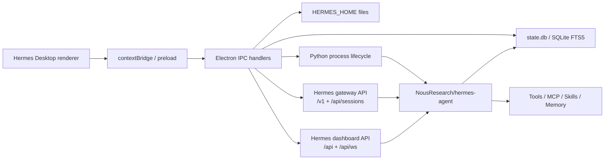
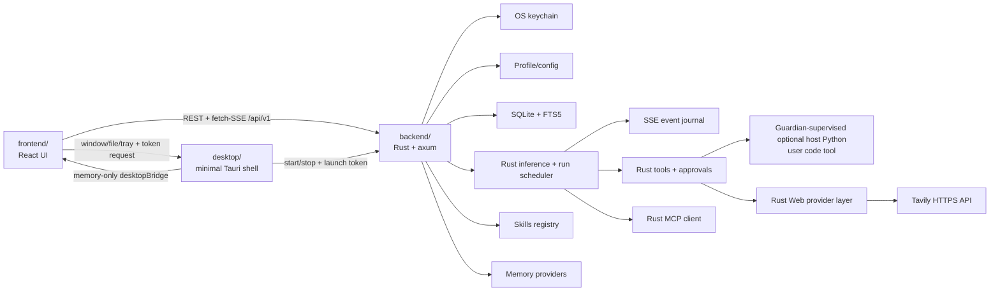

# Hermes Rust 后端迁移：阶段一架构分析

- 状态：`Baseline locked; phase-two skeleton implemented`
- 调研日期：2026-07-16
- 适用范围：SynthChat V1.0.1 渐进式迁移的阶段一

## 1. 结论先行

1. `fathah/hermes-desktop` 不是 Rust 项目。固定版本 `8da8d212abd40b449d55957b2cff9a220797ff71` 是 Electron 39 + React 19 + TypeScript/Node 应用，仓库中没有 `Cargo.toml` 或 Rust 源码。它通过子进程、HTTP、SSE、WebSocket、SQLite 和文件系统管理真正的 Python `NousResearch/hermes-agent`。
2. `NousResearch/hermes-agent` 是推理、工具和消息写入的主要执行运行时；Hermes Desktop 仍会直接管理配置、更新部分 SQLite 会话元数据并读写 Memory Markdown。本次调研固定到 `3f2a389c7e1f1729cad91ae63c26fb08c7753c74`（`hermes-agent 0.18.2`，Python 3.11-3.13）。该仓库约有 3,018 个 Python 文件；其中少量 Rust 文件属于 bootstrap installer，不是 Agent 后端。
3. 因此，“替换为 fathah/hermes-desktop 的纯 Rust 后端”不是抽取现成 Rust 代码，而是以固定版本的 Desktop/Agent 行为为参考进行完整 Rust 重实现。目标明确包含推理循环、工具、会话、Skills、Memory 和 MCP；应用不得托管 Python/Node Agent runtime。该范围显著超过原七周估算，阶段顺序保留，但不能继续承诺原工期。
4. 执行目标是单一 `Hermes-compatible Rust backend`。前端只依赖本项目的 `/api/v1` 契约；Rust 后端直接拥有鉴权、Profile、密钥链、SQLite/FTS、推理与工具循环、SSE、Skills、Memory 和 MCP。上游 Python API、CLI、Dashboard API 与 SQLite schema 仅作为兼容性研究和迁移输入，不成为运行时依赖。
5. 原始基线曾跟踪约 414 MiB 的 `synthchat-data/` 运行数据，其中存在非空敏感字段。阶段二已将其从 Git 索引移除并保留本地副本；凭据轮换、全历史重写和远端强制更新仍是发布前的外部安全门槛，不能只依赖 `.gitignore`。

## 2. 固定的上游基线

| 项目 | 固定版本 | 技术栈 | 许可证 | 本次用途 |
| --- | --- | --- | --- | --- |
| [fathah/hermes-desktop](https://github.com/fathah/hermes-desktop/tree/8da8d212abd40b449d55957b2cff9a220797ff71) | `8da8d212...`，package `0.7.3` | Electron 39、React 19、TypeScript 5.9、Node、better-sqlite3 | MIT | 桌面行为、配置和 UI 适配的兼容参考，不随产品运行 |
| [NousResearch/hermes-agent](https://github.com/NousResearch/hermes-agent/tree/3f2a389c7e1f1729cad91ae63c26fb08c7753c74) | `3f2a389c...`，package `0.18.2` | Python、aiohttp、FastAPI、SQLite FTS5、CLI/TUI gateway | MIT | 推理、工具、会话、技能和记忆的行为测试基线，不随产品运行 |
| SynthChat 当前工程 | `82cb696860d6fdd6b95fcafd901bdf7accda16f9` | React 18、Tauri 2、自研 Rust Agent、JSON 状态库 | 当前根目录无统一 LICENSE | 待迁移系统 |

`hermes-desktop` 的安装器直接下载 `hermes-agent/main`，没有锁定 Agent commit，见 [installer.ts](https://github.com/fathah/hermes-desktop/blob/8da8d212abd40b449d55957b2cff9a220797ff71/src/main/installer.ts#L942)。本项目通过 [`upstream-lock.json`](./upstream-lock.json) 同时锁定两个上游参考版本；升级只更新兼容测试基线，不把上游 runtime 加入安装包。

## 3. 上游真实架构



### 3.1 Hermes Desktop 主要模块

| 领域 | 关键源码 | 行为 |
| --- | --- | --- |
| 安装与生命周期 | [`src/main/installer.ts`](https://github.com/fathah/hermes-desktop/blob/8da8d212abd40b449d55957b2cff9a220797ff71/src/main/installer.ts) | 安装 Python、拉取 `hermes-agent/main`、创建 venv、定位 `HERMES_HOME` |
| 配置 | [`src/main/config.ts`](https://github.com/fathah/hermes-desktop/blob/8da8d212abd40b449d55957b2cff9a220797ff71/src/main/config.ts) | 直接解析和修改 `.env`、`config.yaml`、`auth.json` |
| Profile | [`src/main/profiles.ts`](https://github.com/fathah/hermes-desktop/blob/8da8d212abd40b449d55957b2cff9a220797ff71/src/main/profiles.ts) | 默认 Profile 位于 `HERMES_HOME`，命名 Profile 位于 `profiles/<id>`；创建/删除/切换调用 Hermes CLI |
| 聊天 | [`src/main/hermes.ts`](https://github.com/fathah/hermes-desktop/blob/8da8d212abd40b449d55957b2cff9a220797ff71/src/main/hermes.ts) | 在 TUI gateway WS、`/v1/runs` SSE、`/v1/chat/completions` SSE 和 CLI 之间回退 |
| 会话 | [`src/main/sessions.ts`](https://github.com/fathah/hermes-desktop/blob/8da8d212abd40b449d55957b2cff9a220797ff71/src/main/sessions.ts) | 使用 better-sqlite3 读取 `state.db`，FTS5 搜索，直接删除/更新会话 |
| Dashboard | [`src/main/dashboard.ts`](https://github.com/fathah/hermes-desktop/blob/8da8d212abd40b449d55957b2cff9a220797ff71/src/main/dashboard.ts) | 启动 `hermes dashboard`，生成临时 token，连接 `/api/*` 和 `/api/ws` |
| 工具与技能 | `src/main/tools.ts`、`src/main/skills.ts`、`src/main/remote-skills.ts` | 混用直接配置、Hermes CLI 和 Dashboard API |
| 记忆 | [`src/main/memory.ts`](https://github.com/fathah/hermes-desktop/blob/8da8d212abd40b449d55957b2cff9a220797ff71/src/main/memory.ts) | 读写 Profile 下的 Markdown 记忆文件并展示统计 |
| 密钥 | `src/main/secrets/*`、`src/main/config.ts` | 默认仍是明文 `.env`；可选 command provider 对接外部 vault；账户类数据另用 Electron `safeStorage` |

Hermes Desktop 固定版本有 219 次 `ipcMain.handle` 注册、216 个唯一 channel。这些 handler 是桌面内部接口，不是稳定的远程 API，也不应原样成为本项目的 HTTP 契约。

### 3.2 Hermes Agent 核心模块

| 领域 | 关键源码 | 事实边界 |
| --- | --- | --- |
| Gateway HTTP API | [`gateway/platforms/api_server.py`](https://github.com/NousResearch/hermes-agent/blob/3f2a389c7e1f1729cad91ae63c26fb08c7753c74/gateway/platforms/api_server.py) | aiohttp，默认 `127.0.0.1:8642`，Bearer `API_SERVER_KEY`，支持 OpenAI API、Runs SSE、Session API |
| TUI gateway | `tui_gateway/server.py`、`tui_gateway/ws.py` | JSON-RPC over stdio/WS；拥有最丰富的交互事件，但方法面大且内部耦合强 |
| Dashboard API | [`hermes_cli/web_server.py`](https://github.com/NousResearch/hermes-agent/blob/3f2a389c7e1f1729cad91ae63c26fb08c7753c74/hermes_cli/web_server.py) | FastAPI；提供 Profile、配置、技能、工具、MCP、记忆、会话等管理接口及多个 WS |
| 会话存储 | [`hermes_state.py`](https://github.com/NousResearch/hermes-agent/blob/3f2a389c7e1f1729cad91ae63c26fb08c7753c74/hermes_state.py#L746) | SQLite schema version 21；`sessions`、`messages`、usage 等表；FTS5 与 trigram FTS 表及触发器 |
| 工具集 | [`toolsets.py`](https://github.com/NousResearch/hermes-agent/blob/3f2a389c7e1f1729cad91ae63c26fb08c7753c74/toolsets.py) | 当前固定版本有 57 个静态定义，另有平台组合和插件动态工具集；不能硬编码“14 种” |
| 工具配置 | `hermes_cli/tools_config.py` | 当前可配置列表有 25 项；Hermes Desktop 自身 UI 定义 19 项，并可由插件继续扩展 |
| Skills | `agent/skill_*`、`tools/skills_tool.py`、`hermes_cli/skills_*` | Profile 作用域目录、启停、Hub 安装、审计与更新 |
| Memory | `agent/memory_provider.py`、`agent/memory_manager.py`、`plugins/memory/*` | 本地 Markdown 记忆加可选 provider 插件，不是单一固定的 SQLite memory API |

### 3.3 API 并非一个统一服务

Hermes Agent 有三个不同接口面：

1. Gateway API：面向 Agent 执行，含 `/v1/capabilities`、`/v1/runs`、SSE、`/api/sessions` 等；这是 Rust 行为兼容测试的首要参考接口。
2. Dashboard API：面向官方 Web Dashboard，管理能力更广，但不是 Gateway API 的超集，版本变化也更频繁。
3. TUI gateway JSON-RPC：`/api/ws` 或 stdio，支持 `session.create`、`prompt.submit`、`approval.respond`、`clarify.respond` 等丰富交互；它是内部协议，不应直接暴露给 SynthChat 前端。

Gateway 的 `/v1/capabilities` 已明确声明 `admin_config_rw: false`、`jobs_admin: false`、`memory_write_api: false`。这证明代理上游无法覆盖目标能力面；纯 Rust backend 必须直接实现管理面和执行面。

固定版本的接口规模与鉴权如下：

| 接口面 | 规模 | 流式 | 鉴权 | 稳定性判断 |
| --- | --- | --- | --- | --- |
| Gateway aiohttp | 34 routes | Runs/Chat/Session SSE | 强 Bearer `API_SERVER_KEY` | `/v1/capabilities` 描述的执行面最适合作为行为 fixture 基线 |
| Dashboard FastAPI | 217 个 decorator routes，含 5 个 WebSocket | `/api/ws`、console、PTY、pub、events | 本地临时 session token；远程可用 OAuth cookie/WS ticket | 管理面广，但变化快且不是 Gateway 超集 |
| TUI gateway | 至少 128 个 JSON-RPC method（117 个直接注册 + 11 个 project wrapper） | stdio 或 `/api/ws` | 依赖承载它的进程/WS 会话 | 事件最丰富，但属于内部交互协议 |
| Electron IPC | 219 次注册、216 个唯一 channel | Electron events | Electron context isolation | 只属于 Hermes Desktop 内部，不能作为远程契约 |

上游没有覆盖上述全部接口面的统一 OpenAPI。Hermes Desktop 还包含针对已安装 `hermes_cli/web_server.py` 的兼容补丁逻辑，这进一步说明 Dashboard 管理 API 不能由前端直接依赖。

## 4. 数据流

### 4.1 聊天

Hermes Desktop 当前优先使用本地 TUI gateway；失败时尝试 `/v1/runs` + SSE，再回退到 `/v1/chat/completions` + SSE，最后才 spawn CLI。`/v1/runs` 的 `message.delta`、`reasoning.available`、`tool.started`、`tool.completed`、`approval.request`、usage 和终态事件构成本项目的兼容测试语料，而不是生产 transport。

固定 Agent 版本的 `APIServerAdapter.supports_async_delivery=false`，但纯 Rust 实现不继承该限制。Rust scheduler/event journal 已原生支持后台任务完成、`notify_on_complete` 和 watch pattern：process 与 delivery record 原子创建，重启重扫未决记录，并以 delivered CAS 追加至多一次公开事件。能力仅在 Run runtime 可用时报告为 true，不能静默降级。

新 Rust 后端应：

- 只向前端暴露一个规范化的 Run + SSE 契约；
- 直接执行 Rust inference/tool loop，并产生稳定 ID、稳定 `messageId`/`callId`、单调序号和恰好一次终态；
- 用固定上游版本的录制 fixture/兼容测试验证事件语义，不在生产调用上游 Gateway/TUI；
- 在短时内存或本地事件表中保留可重放窗口，支持 `Last-Event-ID`；
- 不把上游原始 JSON、绝对路径或密钥透传给前端。

### 4.2 Profile 与配置

- Unix 默认目录是 `~/.hermes`；Windows 的 Hermes Desktop 新安装默认可能使用 `%LOCALAPPDATA%/hermes`。实现必须通过统一的 `HERMES_HOME` resolver，不能把 `~/.hermes` 写死。
- 默认 Profile 直接使用 `HERMES_HOME`；命名 Profile 使用 `HERMES_HOME/profiles/<id>`。
- Profile 切换只影响后续新会话和默认视图。已存在的 Session/Run 必须固定到创建时的 `profileId`，不能因全局 active profile 切换而串数据。
- `config.yaml` 修改使用结构化 DTO、保留未知字段、文件锁、临时文件 + 原子 rename 和 revision/ETag；禁止用字符串替换 YAML。

### 4.3 会话

- Rust backend 是新会话和消息的唯一权威写入方，使用自有版本化 SQLite schema、WAL、事务和 FTS5/trigram 索引。
- 对现有 Hermes `state.db` 只提供版本探测和只读导入器；导入到新 schema 后不再与 Python Agent 并发共享写库。
- 兼容导入必须按参考 Agent version 与 schema metadata 选择显式 migration adapter，禁止假设固定列集合。

固定 Agent commit 的 `state.db` schema version 为 `21`。v21 adapter 锁定以下边界：

| 上游数据 | Rust 导入表示 | 约束 |
| --- | --- | --- |
| `schema_version.version` | adapter 选择条件 | 仅显式支持的版本可导入；未知版本 fail closed，不尝试补列或修库 |
| `sessions.id/source/model/title/started_at/ended_at/archived` | Session 元数据与来源 provenance | 导入目标 ID 由来源指纹和上游 ID 确定性生成，避免与原生 ID 冲突 |
| `messages.id/timestamp/role/content` | 每 Session 严格递增的 Message `sequence` | 稳定排序为 `(timestamp ASC, id ASC)`；`active IS NULL` 按锁定上游启动修复的等价语义视为 1 并告警；只导入 `active=1 OR compacted=1`，排除已 rewind 的 `active=0 AND compacted=0` 行 |
| `reasoning*`、`tool_calls`、`tool_call_id`、`tool_name` | Message reasoning 与规范化 tool calls | 畸形 JSON 只产生有界 warning，不阻断其他行，也不把原始 JSON 暴露给前端 |
| `session_model_usage` 与 Session token/cost 聚合列 | Rust usage 明细 | 以来源记录为 provenance，重复导入不得重复累计 |
| `messages_fts*` | 不导入 | 目标 FTS 始终从已验证的目标 Message 重建，绝不复制上游派生索引 |

导入连接使用 SQLite read-only URI、`query_only=ON` 和单一读事务，以同时读取主库与 WAL 的一致快照；adapter 不运行上游初始化、reconcile、repair、checkpoint 或任何 DDL。默认 Profile 的来源是 `HERMES_HOME/state.db`，命名 Profile 是 `HERMES_HOME/profiles/<id>/state.db`，调用方必须显式确认目标 `profileId`。上游 `\0json:` 多模态 content 由结构化解析器处理；文本可直接导入，附件必须经过后续 file store 的大小、MIME 和路径策略，不能把任意 data URL 或本地绝对路径直接写入 API DTO。

每次导入写入独立 provenance 记录（来源快照指纹、schema version、上游 Session/Message ID 摘要与目标 ID 映射）。数据库自身不携带 Git commit 证明，provenance 中的 commit 仅命名为 `referenceCommit`。同一快照重复导入是 no-op；来源内容与既有映射冲突、目标已删除或用户已继续对话时，整个快照事务原子回滚，不覆盖现有 Rust 数据。整批导入只分配一个 session change sequence。

`active=0, compacted=1` 的行保留在历史和搜索中，但目标库内部 `context_eligible=0`，后续推理上下文只读取 `context_eligible=1`，避免同时发送压缩前全文和压缩摘要。附件引用在只读 adapter 中仅保留摘要；预检发现附件时，调用方必须显式同意省略后才能导入，禁止静默丢失。

### 4.4 工具、Skills 与 Memory

- Toolset 列表动态发现，前端不得硬编码 14 项。
- Rust Toolset catalog 与 Profile 级启停管理使用共享 ProfileConfig revision/ETag，no-op 不改 revision，未知 catalog ID 不写入配置。当前 registry 注册 `session_search`、`skills_list`、`skill_view`、`read_file`、`search_files`、`write_file`、`patch`、`terminal`、`process`、`clarify`、`memory`、`web_search`、`web_extract` 和 `execute_code`：Provider 只能看到 Profile 已启用且 registry 已注册、先决条件已满足的严格 JSON schema。四个文件工具还要求 Run 绑定同 Profile 的可用 Workspace 并启用 `file` Toolset；Web 工具要求对应 Profile provider ready；`execute_code` 还要求可用的 host Python 3.8+。每次执行携带共享 `ToolExecutionControl`；RunService 将 terminal/process、Web 和 code execution 路由到异步 executor。`write_file`/`patch`、每次 `terminal`、model-driven `memory` 和整段 `execute_code` 脚本标记为 `ApprovalRequired`；`process` 在 prepare 后动态区分只读 `list/poll/log/wait` 和需新审批的 `kill/write/submit/close`。RunService 只能在 durable `once` 决策与 claim CAS 成功后构造授权。Skill 文件读取限制在对应 Profile 的技能目录，逐段拒绝 symlink/穿越并限制 UTF-8 内容大小。当前内部 schema 为 v12：v8 引入 owner-bound approval ledger，v9 引入绑定 Run/call/checkpoint/原始参数 SHA-256 的 immutable clarification ledger，v10 为 `tool_invocations` 增加 immutable `origin=provider|codeRpc`、`parent_call_id` 和单调 `rpc_sequence` 绑定，v11 增加持久 Run queue 与 epoch-fenced runtime lease，v12 增加 owner-bound async delivery record；tool plan、原始参数/结果、checkpoint、provider turn 和 process metadata 同样只保存在内部 journal，公开 Message/SSE 仅含有界脱敏投影。
- `clarify` 是持久交互工具。创建请求时，ledger、`waitingClarification` pending action 和 `clarification.required` 事件原子提交；用户原始回答只写入私有 ledger，并通过绑定校验且 single-use 的 continuation claim 交给 Provider。取消以 `resolvedBy=cancellation` 解决；backend 重启、deadline、Provider/本地执行失败等任意非取消终止中断统一以 `resolvedBy=failure` 解决，并在 `run.failed` 前持久结束对应 tool。公开事件、Message、Problem 和日志不包含 answer。
- Workspace 文件工具只接受至多 64 KiB 的严格 JSON 参数和至多 1,024 bytes 的相对路径。每次执行以用户注册的 root 打开 `cap-std::fs::Dir` capability，中间目录逐级 `open_dir_nofollow`，最终文件以 `FollowSymlinks::No` 打开；搜索也通过 `Dir.entries` 和子目录句柄递归，不再在 canonical 检查后按 ambient 绝对路径读取。路径穿越、Workspace 逸出、符号链接/重解析点逃逸、Windows 非可移植组件以及凭据、配置、密钥和数据库等敏感名称均被拒绝或排除。`read_file` 只读取不超过 2 MiB 的常规 UTF-8 文本；`search_files` 最多遍历 10,000 个条目和 16 MiB，总结果上限 100。`write_file` 的 UTF-8 内容上限为 60 KiB。`patch` 的 replace 模式实现九策略 fuzzy chain；V4A 模式支持 Update/Add/Delete/Move，并限制为单目标 2 MiB、聚合快照 16 MiB、64 operations/256 hunks。审批前 plan 完成全量预检；审批后在所有目标排序锁内复核 SHA-256 precondition。JSON/YAML/TOML 写前解析，BOM、CRLF 与既有权限保留。单文件提交原子并复读验证；V4A 跨文件不是事务，中途失败以 bounded provider diff 和 explicit partial error 报告。Workspace 注册层提供唯一 ambient root authority；其下访问均保持 capability-relative。
- Terminal 并不继承文件工具的 capability confinement：Workspace 只约束初始 cwd 的解析，shell 启动后可访问绝对路径、网络和其他宿主资源，当前没有 OS/container sandbox。参数上限为 64 KiB，command 上限 32 KiB，stdin 单次上限 32 KiB，workdir 上限 1,024 bytes；前台 timeout 默认 180 秒、最大 600 秒并受 Run deadline 约束。shell 环境经 `env_clear()` 后只从 PATH、用户/临时目录、locale/时区、CA 路径和 Windows runtime 最小 allowlist 重建，不继承 token、key、代理、agent socket、数据库连接或 `SYNTHCHAT_*`。输出并发 drain、有界保留、清理 ANSI/CRLF 并脱敏；4 KiB retention guard 与 live-tail withholding 防止最长 2,560-byte Profile secret 在裁剪边界被切开。
- 后台进程元数据持久化到 `terminal_processes`，owner 固定为 `(profile_id, session_id)`，持久终态不可逆且由 CAS 保护；全局 64 个 `starting|running` 槽在单个 `BEGIN IMMEDIATE` 事务内完成 count + insert。backend 先启动 guardian，持久化 PID/强 identity 后才发送有 magic/version/length 的完整 launch frame，script 不进入 argv；guardian 验证 frame 后才启动 shell，父控制 pipe 断开则终止命令树。后台 result/event 先持久化，再 commit launch lease；此前的 cancel/deadline 默认回滚并 kill。通用 `input_summary` 才能进入 SSE/Message；单行转义、脱敏、限长且带参数 digest 的 `approval_summary` 只用于 pending approval，durable claim 另以 ledger 快照绑定 Run、Profile/Session/Workspace、call/tool、checkpoint 与完整参数 hash。
- stdin `write/submit/close` 使用独立容量队列、有界控制帧和 write deadline，不阻塞 lifecycle supervisor。root 退出、kill 或 cancel 先收敛 Windows Job Object/Unix process group，再最多等待 2 秒 pipe drain；detached kill 只在强 identity 匹配、平台终止成功且 tracked identity 退出后写入 `killed`。终态存储重试后仍失败时内存 fail closed 为 `lost`；重启只保留 PID + 强 identity 匹配的 detached metadata，其他候选项以 CAS 标记 `lost`。Windows identity 为 creation FILETIME，Linux 为 boot ID + start ticks，macOS 为 `proc_pidinfo` 启动时间；三平台均使用 guardian，Windows 另用 Job Object，Unix 使用 process group，Linux 前台 guardian 另有 parent-death signal。
- 当前 `pty=true` 在 prepare 阶段被拒绝，调用方必须使用 `pty=false`。当 Run runtime 可用时，后台 terminal 可选择 `notify_on_complete=true` 或非空 `watch_patterns`（二者不得组合）；私有 delivery record 在重启后重扫，并以 CAS 写入至多一次公开 `tool.delivery`。Windows 尚无 ConPTY。guardian/launch lease 封闭常规交接和取消窗口，但不提供 OS sandbox、外部副作用回滚或 exactly-once shell 事务；发布前仍需三平台 hard-crash、长时间深层 descendant 和 PID reuse 原生回归。
- `execute_code` 是 Rust Run/tool loop 内的可选用户代码 executor，不是 Python Agent runtime。Rust 仅在 Run/session runtime 可用且探测到非 WindowsApps alias 的 Python 3.8+ 后报告 `codeExecution=true`，并在 durable `once` 审批和 execution claim 成功后，把代码与生成的 `hermes_tools.py` 写入私有 staging。direct guardian 通过强类型 frame 接收 Python executable、argv、清理后的环境和一次性 loopback RPC bootstrap；只有 guardian 把 RPC port/token 注入直接子进程。`project` mode 在 Run 有 Workspace 时以其为 cwd，`strict` mode 以 staging 为 cwd；两者都允许 Python 直接使用宿主文件、网络、subprocess 和 native library，因而都不是 sandbox。
- 脚本整体审批同时覆盖动态白名单中的 nested mutating RPC；nested 调用仍复用既有路径、SSRF、hard-deny、参数 schema、deadline 和取消策略，但不创建第二个公开审批。v10 journal 只允许 running 的顶层 provider `execute_code` 作为 `codeRpc` parent，以 `(run_id,parent_call_id,rpc_sequence)` 唯一且顺序记录 nested 参数和结果；Provider continuation 的顶层 tool-call 列表只读取 `origin=provider`，因此 nested rows、nested 参数和 nested 结果不会被提升为顶层调用。完整代码、stdout、文件内容和 nested 私有数据只用于内部 journal/Provider continuation，不进入公开 SSE/Message；pending approval 仅显示有界、脱敏并带 digest 的代码预览。stdout 使用 50 KB head-tail、stderr 使用独立 10 KB head-only capture，二者在进入私有结果前执行 Profile secret 与 token/Bearer 脱敏。Run cancel/deadline/backend disconnect 通过 guardian 的 Job Object/process group 回收受管 Python 树；Run 已进入 `cancelling` 后只允许父 invocation 以 failed 终结，晚到 success 不能覆盖取消。
- Toolset 与已安装 Skill 的发现、搜索和启停由 Rust registry 完成；Skills 安装/卸载通过持久 Operation、owner lease、崩溃恢复和 capability-relative 存储实现。上游 CLI/Dashboard 只用于生成兼容 fixture，不在产品中调用。
- Hermes 本地 Memory 的真实形态包含 Profile-scoped `memories/MEMORY.md`、`memories/USER.md`（`"\n§\n"` entry delimiter）和可选 provider。结构化 DTO 是仅面向 `builtin` 的兼容层：非 builtin Profile 的所有 Memory routes 返回 422 `memory_provider_unsupported`，绝不把外部 provider 冒充为空的 builtin 列表。每个 target 使用独立 strong revision/ETag；entry ID 与 cursor 都绑定该 revision，所有写操作在跨进程 lock 下复核 ETag、规范 round-trip 与磁盘漂移，再通过同目录原子替换提交。POST 还绑定 durable idempotency record；exact duplicate add 是不改 revision 的成功 no-op。
- Memory 内容的单条契约上限为 2,200 chars，完整 target 受配置预算约束（builtin 默认 MEMORY 2,200、USER 1,375）。REST POST/PATCH 与 Run snapshot 构建均使用 strict threat scan；已有危险正文可在经鉴权管理面删除，但不能进入 prompt。每个 Run 在首次 `prepare_model` 时冻结 MEMORY/USER snapshot，后续 Provider turns 不重新加载，Run 中写入只影响下一 Run。模型 `memory` 写操作（包括以最终 target 预算校验的原子 batch）必须复用 durable `once|deny` approval 和 single-use execution claim；公开 Run/SSE/Message/Problem/approval summary 只能含有界脱敏状态，不得携带 entry 正文。

### 4.5 Web 与 Browser 分离

锁定 Agent 中的 Web 域是 provider-dispatched `web_search`/`web_extract`：search 返回标题、URL、描述和位置，extract 接受最多 5 个 URL 并返回有界 clean content。Browser 是另一个有状态资源域，包含 navigate、accessibility snapshot、click/type/scroll/back/press、images、vision、console、raw CDP 与 dialog；其 cloud provider 只提供 create/close/emergency-cleanup 和 CDP URL，不能用一次 HTTP 抓取替代浏览器生命周期。

Web-first 的 Rust 控制面固定为：`GET /api/v1/web/providers` 发现已实现 adapter，`GET/PATCH /api/v1/profiles/{profileId}/web` 管理非敏感 provider 选择和 extract 字符预算，现有 Profile Secret API 管理 `TAVILY_API_KEY`。当前唯一可选择 adapter 是 Tavily；endpoint 默认是官方地址，可信部署可通过 `SYNTHCHAT_TAVILY_BASE_URL` 在启动时覆盖，但 Profile 始终不能覆盖，catalog 返回后端实际生效值。其他上游 provider 只保留在兼容矩阵，Rust adapter 未完成前不得出现在可选择 catalog、effective fallback 或 Run tool definitions 中。

能力与 readiness 分开：Web-first 验收目标是 `webSearch=true`、`webExtract=true`，但具体 Run 还必须同时满足 `web` Toolset enabled、对应 effective provider status=`ready` 和 Rust registry 已注册。Browser 的 `browserAutomation`、`browserCdp` 与 `browserDownloads` 仅在 Run engine 可用且本机发现支持的 Chromium-family binary 时为 true。具体 Run 还需 Profile `browser` Toolset enabled、registry 注入和 owner-bound Run context。OpenAPI 契约不是实现证据；这些值只有 routes、executor、安全策略和实际 headless fixture 验收后才可开启。

Web 网络层必须由 Rust 直接执行，不调用 Python/Node Hermes、shell、curl 或浏览器旁路。Tavily secret 只从 Profile keychain 进入单次请求内存；客户端使用 rustls、禁止 redirect、限制响应类型/字节/时间与并发。所有 extract URL 在调用前检查 scheme、userinfo、credential/query、全部 DNS 地址及 metadata/private/special ranges，返回 URL再次检查。搜索结果和网页正文始终标记为 external-untrusted，执行控制字符清理、base64/data/blob 剔除、secret redaction 和 UTF-8 有界截断；完整内容只进入私有 invocation/provider continuation，公开事件只含脱敏摘要。

Browser 已使用独立 Rust `BrowserManager` 和纯 Rust WebSocket CDP client 控制外部 Chromium/Chrome/Edge；不引入 Node `agent-browser` 或 Python runtime。每个 `(Profile, Session, Run)` 有独立 user-data-dir、`--remote-debugging-address=127.0.0.1 --remote-debugging-port=0`、随机 loopback egress proxy、现有 Job Object/process-group containment，并在完成、取消、失败、崩溃检查或 backend teardown 时回收。CDP URL 只驻内存。导航先做 URL/DNS public-address 检查，所有 HTTP/HTTPS 子资源经 loopback proxy 再解析并连接到已验证 IP；private、loopback、link-local、metadata、special-range 目标被拒绝。AX snapshot、console 和 JPEG image output 均有固定上限；click/download/type/scroll/back/press/dialog 及唯一允许的 raw CDP `Runtime.evaluate` 同时要求当前 snapshotId、owner-bound durable `once/deny` approval 和参数 digest claim。下载默认保持 `deny`；批准动作只临时把单个下载写入 capability-relative 私有目录，以 8 MiB/16 MiB/4 次上限检查文件名、MIME、magic、长度及 SHA-256，仅返回无路径元数据后删除内容。启动恢复只删除经过 bounded recursive no-link/no-reparse 校验的 stale run 目录；当前不存在下载到 Files/Workspace 的导入路径。

## 5. 推荐目标架构



建议目录：

```text
frontend/                  React/Vite、OpenAPI client、分域 stores
backend/                   独立 Cargo workspace，纯 Rust Hermes-compatible backend
  src/api/                 只含本项目 v1 DTO 与 routes
  src/engine/              inference loop、run scheduler、context、approval
  src/providers/           OpenAI-compatible 与其他模型 transport
  src/compat/              固定上游版本的配置/数据库只读导入器
  src/config/              HERMES_HOME、Profile、YAML 原子读写
  src/session/             自有 SQLite schema、FTS read/write model
  src/secrets/             OS keychain
  src/tools/               Rust tool registry、policy、approval
  src/web/                 Web provider catalog、Profile 配置、URL/egress policy、Tavily adapter
  src/mcp/                 MCP transports 与 tool discovery
  src/skills/              Skills parser、installer、registry
  src/memory/              builtin/provider memory
desktop/                   可选；精简 Tauri 壳层，不含 Agent 业务
docs/
scripts/
```

### 5.1 端口与进程

- Desktop 启动 backend 时传入 `127.0.0.1:0`，由 OS 在 bind 时原子分配端口。backend 只在成功 bind 后通过专用 stdout 行返回实际地址；Desktop 对握手执行 128-byte 上限、换行、非零 loopback 和配置 IP 匹配校验，再使用 stdin 传入的随机 token 请求受保护 capabilities。地址不经预选/释放，因此默认路径没有端口选择 TOCTOU。
- `SYNTHCHAT_BACKEND_ADDR` 可为 standalone 开发或诊断显式选择 loopback 地址；未设置时 standalone server 仍使用通用开发默认 `127.0.0.1:8642`。Desktop 会显式覆盖为动态端口，前端只从窄化 Tauri bridge 获取当次实际 base URL，不把端口写入生产 bundle。
- desktop 壳先持有单实例锁，再启动并唯一管理自己的 backend 子进程。最终产品只有一个 Rust listener，不分配 Python worker 端口；旧 listener 占用 8642 不再影响 Desktop 默认启动，但固定端口覆盖发生冲突时必须明确失败。
- 生产环境只绑定 loopback，拒绝 `0.0.0.0`。远程模式另立经过显式认证与 TLS 的后续版本。

前端认证链路：

1. desktop 每次启动用系统 CSPRNG 生成至少 256-bit 的 frontend bearer token，只保存在 desktop/backend 进程内存中；重启后旧 token 失效。
2. desktop 通过继承 pipe/stdin 将 token 交给新 backend，不放入命令行、URL、磁盘或日志。
3. frontend 通过窄化 Tauri command 取得当前 token 并只保存在 JS 内存；REST 与基于 fetch 的 SSE 都发送 Authorization header。
4. browser-only 开发模式通过 Vite loopback proxy 注入仅保存在 Node 进程中的 token；生产构建不得包含固定 dev token 或无认证旁路。

### 5.2 所有权规则

| 数据 | 权威写入方 | 前端可见内容 |
| --- | --- | --- |
| UI 临时状态、主题展示 | 前端 | 全部 UI 数据 |
| Profile 元数据、config.yaml | Rust backend | 非敏感结构化字段、revision |
| Provider/API keys | OS keychain | `configured`、来源和更新时间；绝不返回值 |
| Session/messages | Rust backend | 规范化 Session/Message DTO |
| Session FTS read/write model | Rust backend | 命中摘要，不返回 DB 路径 |
| Run events | Rust scheduler/event journal | 版本化 SSE envelope |
| 本地文件 | Rust/desktop bridge | opaque file ID；不返回绝对路径 |
| 窗口、托盘、拖放、桌宠 | minimal Tauri shell | 不进入 Agent REST API |

### 5.3 密钥到 Rust 执行器的桥接

- keychain service 固定为本应用标识，account 使用 `{profileId}:{secretName}`；API 只接受 Provider/tool catalog 允许的 secret name，不能借此注入任意环境变量。
- Rust 为每个 Provider/tool 维护显式 `secretName -> consumer field` 映射。调用模型 API 时只在内存中构造 Authorization；启动获批的外部命令工具时，只向该子进程注入声明过的最小 secret 集合，不生成明文 `.env`。
- Secret 更新或删除只影响更新后创建的 Run/Tool call。已开始的请求保留其内存快照直至结束，随后 zeroize；新请求不得继续使用已删除值。
- 1Password/Bitwarden 可作为后续 Rust secret-source plugin，但不能绕过 write-only API 契约。
- v1 keychain 范围覆盖 API key、工具 secret 和由 Rust OAuth adapter 管理的 refresh/access token。旧 Hermes `auth.json` 只作为一次性迁移输入；迁移、刷新和撤销实现完成前 capabilities 必须标为不可用。

## 6. 安全基线

1. 后端只监听 `127.0.0.1`，CORS 使用明确的 Tauri 和开发源 allowlist，禁止 `*`。
2. 除 `GET /health` 外，所有请求使用每次 desktop 启动生成的 Bearer token；SSE 同样鉴权。
3. API key 进入 `keyring`/系统密钥链。`config.yaml` 只保存 secret reference，响应仅返回配置状态。
4. 对 `config.yaml`、`.env`、`auth.json`、SQLite 和 Skill 路径实施 Profile 根目录约束及符号链接检查。
5. Tool approval 默认 fail closed；前端只能使用服务端签发的 `approvalId` 决策，不能提交任意工具参数来绕过 Agent。
6. Rust 日志统一脱敏，不记录 Authorization、secret value、完整本地路径或用户会话正文。外部工具 stdout/stderr 经 Rust 捕获、限长和过滤；支持包导出前必须再次执行脱敏扫描。
7. 文件上传使用大小/MIME 限制和 opaque ID，Agent 使用前再次验证路径归属。
8. Web egress 只经 Rust policy/client；启动时注入且 Profile 不可变的 provider authority 不跟随 redirect，发送 key 前对全部 DNS 结果 fail closed 并固定连接地址，目标 URL 同样校验，网页内容按不可信输入脱敏、限长且不进入公开事件。

## 7. 主要风险与应对

| 风险 | 证据/影响 | 应对 |
| --- | --- | --- |
| 完整 Rust 重写范围巨大 | 上游 Desktop 无 Rust，Agent 为 Python，无法复用现成后端 | 保留阶段门槛；按能力逐域实现；以上游 fixture 做兼容测试；取消原七周承诺 |
| 上游漂移 | Desktop 安装器直接跟随 Agent `main` | 双 commit lock；fixture diff；兼容矩阵和升级测试 |
| 兼容参考 API 不稳定 | 管理 API 与 Gateway 分离且规模很大 | 生产不调用上游 API；固定 fixture/兼容矩阵；升级显式评审 |
| 旧 SQLite schema 漂移 | 当前参考 schema version 21 | 只读版本化 importer；新 Rust schema 独立迁移，不共享写库 |
| Profile 串线 | 上游存在全局 active profile 概念 | Session/Run 固定 `profileId`；每 Profile 独立 scheduler/config state |
| 端口冲突与地址冒充 | 固定 8642 会与旧 listener 冲突；预选空闲端口还存在释放后的 TOCTOU | Desktop 让 backend 直接 bind loopback port 0，经 child stdout 有界握手和 Bearer capabilities probe 验证；固定地址仅作为显式 standalone 覆盖 |
| 工具数量写死 | “14 种”已过期且插件可扩展 | `/toolsets` 动态发现和 capabilities 驱动 UI |
| Web 与 Browser 混合宣称 | Web 是无浏览器 HTTP provider，Browser 还拥有进程/CDP/session/交互状态 | Web-first 使用独立 capability 和配置面；三个 Browser flag 仅在完整生命周期验收且运行时发现受支持 Chromium 后为 true |
| DNS rebinding/redirect SSRF | 上游 URL 预检明确存在 DNS TOCTOU，浏览器还可发起子资源请求 | Web provider endpoint 由可信启动配置注入、Profile 不可覆盖，拒绝 redirect 并把已验证 DNS 结果固定到连接；extract 目标继续执行全地址预检；Browser 使用 Rust egress proxy/网络策略 |
| 异步投递语义复杂 | 上游不同 transport 行为不一致 | Rust scheduler + 持久 event journal 已实现；仅在 Run runtime 可用时报告为 true，并保持公开投影脱敏 |
| 密钥存储不达标 | 上游默认 `.env`，当前 SynthChat 也明文持久化 | Rust keychain adapter；只写 secret refs；迁移后轮换旧 key |
| OAuth 凭据仍使用文件 | Hermes 账户流程依赖 `auth.json` | v1 标记未迁移能力；另立安全存储与刷新/撤销 ADR |
| Git 历史曾含运行数据 | 基线含 `synthchat-data/` 1,732 tracked files，约 414 MiB；当前索引已清零 | 轮换、隔离备份、经批准后 `git filter-repo` 清历史、重新审计 |
| 许可证归属 | 两个上游均 MIT，当前根目录无统一 LICENSE | 复制实现前加入 LICENSE/NOTICE 与来源记录 |

## 8. 架构决策门槛

当前执行决策：

**ADR-001（已否决备选）**：Rust 控制面托管固定 Python Hermes Agent。该方案较快，但不满足“所有 Agent 后端纯 Rust”的项目目标。

**ADR-002（执行基线）**：`backend/` 是唯一前端后端和完整 Rust Agent runtime；两个上游 commit 仅作为行为、配置和数据迁移参考，发布物不包含 Python Hermes Agent、Electron Desktop 或其服务进程。

ADR-002 包含推理 transport、工具/MCP、Skills、Memory provider、审批、会话 schema、event journal 和兼容导入器的完整重写。因此原阶段顺序继续使用，但原七周排期失效；每个 capabilities flag 只有在对应 Rust 实现和端到端测试完成后才能置为 true。

阶段状态（2026-07-18）：阶段二骨架、Profile/config/keychain、Session/FTS5、Hermes v21 原子导入、Run/SSE 流式推理、Toolset 管理、Skills 发现/启停/安装/卸载、builtin Memory、Tavily Web Search/Extract、`execute_code`、含隔离下载的 Browser Rust vertical slice、持久 FIFO Run 队列、active Run discovery 和后台 terminal 异步投递已实现。Rust-owned Session schema 当前为 v12；v8 引入 owner-bound approval ledger，v9 引入 bound immutable clarification ledger，v10 引入 `provider|codeRpc` invocation origin 与 parent/sequence 绑定，v11 引入持久 Run queue 与 epoch-fenced runtime lease，v12 引入 owner-bound async delivery record。Run event journal 支持 `Last-Event-ID`，内部 journal 支持先计划后执行、CAS checkpoint、原始参数/结果隔离、不可变决策、单次执行/continuation claim 与通用中断 fail-closed。`toolExecution=true`/`toolProgress=true` 覆盖严格 registry 中已满足 readiness 的 Rust tools；Browser 仅在本机 Chromium discovery 和 Profile Browser Toolset enabled 时注入。`browserAutomation/browserCdp/browserDownloads` 由同一运行时 readiness 动态报告。

2026-07-18 补充：MCP 的 stdio、Streamable HTTP 与 legacy SSE runtime 已完成；三个细分 capability 均为 true。远端 transport 每次 DNS 解析后固定目标地址、手动逐跳验证 redirect，Bearer 与 Streamable HTTP session ID 分别限制在各自 origin；本地真实 fixture 及两条 Run E2E 覆盖发现、工具注入、审批、私有 continuation 与公开投影脱敏。Skills 生命周期、持久队列和 active Run discovery 均有独立 HTTP/Run 恢复测试覆盖。

Web-first 已完成 provider catalog、Profile Web GET/PATCH、Tavily keychain 引用、严格工具 schema、Rust executor、分域 capability 与 egress/SSRF 边界，并由 HTTP/Run E2E 覆盖独立 readiness、取消、重放、幂等和公开投影脱敏。Browser 的本地 Rust vertical slice 同样已完成：可发现 Chromium 时 runtime 将 `browserAutomation/browserCdp/browserDownloads` 置为 true，严格 Browser Toolset 才向 Run 注入 13 个工具；真实 headless Chrome loopback fixture 覆盖导航、AX snapshot 与隔离下载，fake CDP fixture 覆盖 JSON-RPC/download events，Run E2E 覆盖 owner-bound approval、只含元数据的 provider continuation 与终态清理。Tavily 在远端重新解析并抓取 extract URL，本地预检无法 pin 其最终连接地址，因此远端 DNS rebinding TOCTOU 作为 provider-boundary 残余风险保留。

Terminal/process 当前已完成 guardian、launch lease、原子容量、有界 stdin/pipe、强 identity、tree kill 核验、输出边界脱敏、审批摘要隔离和 completion/watch 异步投递，并通过常规前台/后台 E2E；它仍不是 OS sandbox 或 exactly-once shell 事务。PTY 与三平台原生 hard-crash/长时间回归仍需在阶段四完成。

同日完整验证基线为 backend unit `246/246`、integration `91/91`（合计 `337/337`），frontend `389/389`，desktop `1/1`；backend/desktop fmt 与 `clippy -D warnings`、OpenAPI drift、TypeScript 和 Vite production build 均通过。`execute_code` Run E2E 覆盖审批后 Python + nested `read_file`、Profile secret 不进入子进程环境、deny 后零启动/零 nested row、cancel 后进程树与 heartbeat 停止，以及公开 Run/SSE/Message 不泄露代码、stdout、文件内容或 nested 参数。Browser UI 自动化、压力/长稳、三平台原生 crash/process 矩阵仍未完成，不能由该基线外推为阶段四验收通过。

Memory/Profile 路径检查会拒绝静态 symlink 和 Windows reparse point，最终文件打开使用 no-follow；但验证后父目录被并发替换仍需 handle-relative I/O 才能从机制上消除。该本地同权限竞态保留为阶段四 Windows 安全门槛，不以当前静态检查替代三平台原生验证。

继续后续阶段仍必须同时满足：

- 正式记录 ADR-002，并接受原七周估算失效；
- 确认非 Hermes UI 功能的去留，见 `docs/code-impact.md`；
- 轮换已进入 Git 历史的凭据并制定历史清理窗口；
- 批准 `docs/api-contract.md` 与 `docs/openapi.yaml`；
- 决定保留精简 Tauri 壳层还是改用其他桌面包装方式；
- 确认 OAuth `auth.json` 是否纳入首版安全迁移。
