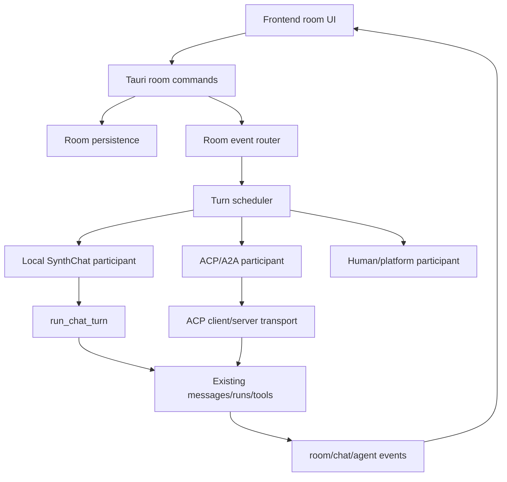

# A2A/ACP Group Chat Integration Plan

Date: 2026-06-28

This document is the baseline plan for adding group chat with full A2A/ACP-style multi-agent conversation capability to SynthChat. Future implementation work should follow this plan unless a later design document explicitly supersedes it.

## 1. Goal

Add a real group-chat subsystem where humans, local SynthChat agents, delegated worker agents, and external ACP/A2A agents can participate in the same room with ordered messages, turn scheduling, delivery guarantees, recoverable failures, and clear UI state.

The target is not just "multiple agents appear in one transcript". The target is a room-level orchestration layer that can:

- persist rooms, members, messages, turn state, and delivery records;
- schedule participant turns deterministically;
- map each participant to the correct runtime transport;
- isolate private memories/tool scopes while sharing the room transcript;
- queue late user/platform messages instead of dropping them;
- expose group state to the frontend without leaking internal reasoning/tool plumbing;
- support ACP-compatible external agents without coupling the whole room model to ACP sessions.

## 2. Current Project Baseline

### 2.1 Persistence

Current persistence is centered on `PersistedState` in `src-tauri/src/store.rs`.

Relevant existing state:

- `conversations: Vec<Conversation>`
- `messages: HashMap<String, Vec<ChatMessage>>`
- `agent_runs: Vec<AgentRunRecord>`
- `agent_queue: Vec<AgentQueuedRequest>`
- `short_context: HashMap<String, ShortContextState>`
- tool traces, approvals, memories, providers, MCP servers, plugins, skills

`Conversation` already has `metadata: Value`, which is useful for backward-compatible flags. However, a full group room should not be implemented only as arbitrary `metadata`; the room needs typed records so persistence, cleanup, migration, and frontend APIs stay reliable.

`ChatMessage` is currently bound to one `conversation_id`, with role/source/provider data. This can continue to be the display transcript primitive, but group chat needs extra sender/member metadata.

### 2.2 Chat Turn Runtime

`run_chat_turn` and `run_chat_turn_with_toolset_policy_and_iteration_limit` in `src-tauri/src/agent/agent_loop.rs` are the main turn execution path.

Important existing behavior:

- A per-conversation admission lock prevents overlapping turns in the same conversation.
- Busy input can be queued/steered/interrupted depending on config.
- User, assistant, and tool messages are persisted into `messages[conversation_id]`.
- Lifecycle events use `synthchat-chat-event` with `turn_started`, `turn_finished`, `new_message`, `assistant_message`, and `tool_message`.
- Queue draining exists per conversation via `drain_queued_requests_for_conversation`.

This is valuable, but it is still single-conversation/single-active-agent oriented. A group room should reuse the turn executor, not turn the existing executor itself into the group scheduler.

### 2.3 Delegation Runtime

`delegate_task` currently lives in `src-tauri/src/agent/delegation*.rs`.

Important existing behavior:

- A parent run creates hidden internal child conversations.
- Child runs are linked by `parent_run_id`, `subagent_index`, `subagent_role`, `subagent_task`, and related fields.
- SynthChat child agents run through the normal `run_chat_turn` path.
- ACP child agents run through ACP-specific delegation.
- Batch delegation currently represents parent-child task fanout, not peer group chat.

`delegate_task` is not a group-chat model. It can supply implementation pieces for worker lifecycle, scope narrowing, diagnostics, and result aggregation, but group chat needs room-level continuity, participant identity, and inter-participant message routing.

### 2.4 ACP Runtime

The Rust ACP implementation already exists under `src-tauri/src/agent/acp_*.rs`.

Important existing behavior:

- ACP sessions are represented as conversations.
- ACP session runtime config is stored in conversation metadata.
- ACP prompts use `SendChatRequest` and the normal chat turn path.
- ACP queue handling drains per session.
- Session list/load/resume/fork are supported.

This means SynthChat already has a strong ACP session substrate. For group chat, ACP should be treated as a participant transport, not as the group room model itself.

### 2.5 Frontend Runtime

The frontend state in `src/lib/types.ts`, `src/lib/store.ts`, `src/lib/api.ts`, and `src/App.tsx` is centered on:

- `Conversation`
- `ChatMessage`
- `AgentRunRecord`
- `AgentQueuedRequest`
- active conversation messages
- chat event and agent run event listeners

There is currently no typed group room/member/turn state in the frontend. The frontend can reuse message rendering and agent-run timeline pieces, but needs explicit room/member state and room-level event handling.

## 3. Reference Targets

### 3.1 Core Reference: `E:\SynthChat\hermes-agent-main`

The core reference has several patterns worth importing conceptually:

- `gateway/session.py` models `SessionSource` with platform, chat id, chat type, user id, thread id, guild id, parent chat id, and message id.
- `SessionContext` separates source context, connected platforms, home channels, and whether a session is shared multi-user.
- Config includes a `group_sessions_per_user` style distinction: group/channel chats may use one session per participant instead of one shared room brain.
- `gateway/delivery.py` separates delivery target parsing/routing from agent execution.
- `acp_adapter/session.py` persists ACP sessions, tracks runtime locks, queued prompts, cancellation, cwd, model, and history.

For SynthChat, the useful lesson is: room identity, sender identity, delivery identity, and agent runtime identity must be separate concepts.

### 3.2 Multi-Agent-Playground Reference

`Jasper-zh/Multi-Agent-Playground` is useful as a workflow-shape reference. Its README describes FastAPI + Vue/Electron and five LangGraph workflow types:

- `single_agent_chat`
- `router_specialists`
- `planner_executor`
- `supervisor_dynamic`
- `peer_handoff`

For SynthChat, these map naturally to room orchestration modes:

- direct chat: one addressed participant replies;
- router specialists: route a message to one or more matching members;
- planner executor: planner member creates tasks, executor members respond, synthesizer member summarizes;
- supervisor dynamic: moderator schedules turns dynamically;
- peer handoff: one participant hands control to another.

Do not copy this project architecture wholesale. Use its workflow taxonomy to define room scheduler modes.

## 4. Target Architecture

The group system should introduce a new room layer above conversations and runs:



The group room is the authoritative coordination object. Existing conversations/runs remain execution and transcript primitives.

## 5. Data Model

Add typed records in `src-tauri/src/models.rs` and `PersistedState`.

### 5.1 `GroupRoom`

Fields:

- `id: String`
- `title: String`
- `conversation_id: String`
- `created_at: String`
- `updated_at: String`
- `state: String` (`active`, `paused`, `archived`)
- `mode: String` (`manual`, `round_robin`, `router_specialists`, `planner_executor`, `supervisor_dynamic`, `peer_handoff`)
- `default_scheduler_id: Option<String>`
- `metadata: Value`

Notes:

- `conversation_id` points to the visible transcript conversation.
- The conversation can carry `metadata.groupRoomId`, but typed `GroupRoom` remains canonical.

### 5.2 `GroupMember`

Fields:

- `id: String`
- `room_id: String`
- `display_name: String`
- `kind: String` (`human`, `local_agent`, `acp_agent`, `platform_user`, `system`)
- `persona_id: Option<String>`
- `agent_id: Option<String>`
- `transport: String` (`local`, `acp_server`, `acp_subprocess`, `wechat`, `desktop`, `pet`, `external`)
- `transport_config: Value`
- `role_prompt: String`
- `tool_scope: Value`
- `memory_scope: String` (`private`, `room_shared`, `hybrid`)
- `status: String` (`active`, `muted`, `busy`, `failed`, `left`)
- `created_at: String`
- `updated_at: String`
- `metadata: Value`

Notes:

- Member identity must be stable. Do not infer member identity from message source strings alone.
- External ACP participants should be members with ACP transport config, not separate hidden rooms.

### 5.3 `GroupMessage`

Fields:

- `id: String`
- `room_id: String`
- `conversation_id: String`
- `chat_message_id: String`
- `sender_member_id: Option<String>`
- `target_member_ids: Vec<String>`
- `message_type: String` (`user`, `assistant`, `tool_summary`, `system`, `control`)
- `visibility: String` (`room`, `member_private`, `debug`)
- `turn_id: Option<String>`
- `delivery_state: String` (`pending`, `delivered`, `failed`, `suppressed`)
- `created_at: String`
- `metadata: Value`

Notes:

- Keep `ChatMessage` as display content; use `GroupMessage` as the room envelope.
- Tool-level messages should normally be summarized or hidden in group rooms unless the UI has a debug panel open.

### 5.4 `GroupTurn`

Fields:

- `id: String`
- `room_id: String`
- `trigger_message_id: Option<String>`
- `scheduler_mode: String`
- `state: String` (`queued`, `running`, `completed`, `failed`, `aborted`)
- `current_member_id: Option<String>`
- `planned_member_ids: Vec<String>`
- `completed_member_ids: Vec<String>`
- `failed_member_ids: Vec<String>`
- `started_at: Option<String>`
- `completed_at: Option<String>`
- `error: Option<String>`
- `metadata: Value`

### 5.5 `GroupDelivery`

Fields:

- `id: String`
- `room_id: String`
- `message_id: String`
- `target_member_id: String`
- `transport: String`
- `state: String` (`pending`, `sent`, `acked`, `failed`, `skipped`)
- `attempts: u32`
- `last_error: Option<String>`
- `created_at: String`
- `updated_at: String`
- `metadata: Value`

This record is important for avoiding the class of problem where the frontend shows a message but the backend/provider never actually received it.

## 6. Backend Modules

Add a focused module family:

- `src-tauri/src/group_chat.rs` as the public facade and Tauri command integration.
- `src-tauri/src/group_chat/models.rs` only if model size becomes large; otherwise keep serde models in `models.rs`.
- `src-tauri/src/group_chat/store.rs` for room/member/message/turn CRUD wrappers around `AppStore`.
- `src-tauri/src/group_chat/router.rs` for incoming message normalization and room event fanout.
- `src-tauri/src/group_chat/scheduler.rs` for turn planning and admission locks.
- `src-tauri/src/group_chat/participants.rs` for participant runtime dispatch.
- `src-tauri/src/group_chat/acp_transport.rs` for ACP/A2A participant calls.
- `src-tauri/src/group_chat/events.rs` for frontend event payloads.

Expose through `src-tauri/src/agent.rs` only where group turns intentionally reuse `run_chat_turn`.

## 7. Runtime Flow

### 7.1 Creating a Room

1. Create a normal `Conversation` for display transcript.
2. Create `GroupRoom` pointing at that conversation.
3. Add creator/human member.
4. Add selected local/ACP members.
5. Emit `synthchat-group-event: room_created`.

### 7.2 Sending a Room Message

1. API receives `SendGroupMessageRequest`.
2. Router resolves `room_id`, sender member, targets, and source.
3. Persist `ChatMessage`.
4. Persist `GroupMessage`.
5. Persist one or more `GroupDelivery` rows if the message must be delivered to transports.
6. Enqueue a `GroupTurn` if the message should trigger agent replies.
7. Emit `synthchat-group-event: message_created`.
8. Scheduler drains room queue.

The user-visible message must not be considered complete until the backend has persisted the `GroupMessage`. For platform bridges, provider delivery status must be explicit.

### 7.3 Scheduling a Turn

The scheduler should hold a room-level lock, separate from existing per-conversation `CHAT_TURN_LOCKS`.

Initial modes:

- `manual`: only addressed members reply.
- `round_robin`: next active member replies.
- `router_specialists`: router chooses members by role/tool scope.
- `planner_executor`: planner proposes tasks, executor members respond, synthesizer summarizes.
- `supervisor_dynamic`: moderator chooses next speaker until stop condition.
- `peer_handoff`: current speaker can nominate next speaker.

Execution rules:

- one room turn can run at a time by default;
- participant turns may run sequentially first;
- parallel participant execution can be added later only for isolated local agents or isolated ACP transports;
- browser/MCP-heavy participants should default to sequential unless explicit isolated runtime config exists;
- late human messages must enqueue or interrupt according to room policy, never disappear.

### 7.4 Dispatching a Local SynthChat Member

For local members:

1. Build a member-specific prompt from room transcript, addressed message, role prompt, and memory policy.
2. Call `run_chat_turn_with_toolset_policy_and_iteration_limit`.
3. Use a member-private execution conversation when private memory/tool traces should stay isolated.
4. Mirror final assistant output into the room transcript as a `ChatMessage` and `GroupMessage`.

Important design choice:

- Display transcript conversation and execution conversation can be different.
- This avoids contaminating each agent's private context with every room message while still showing one shared room transcript.

### 7.5 Dispatching an ACP/A2A Member

For ACP members:

1. Resolve or create the member's ACP session.
2. Send the room turn as an ACP prompt.
3. Stream notifications into room events.
4. Persist final output as room message.
5. Record delivery status and errors.

Do not model the entire room as one ACP session. Each ACP participant gets its own session/runtime unless a future protocol explicitly supports multi-party sessions.

## 8. Memory and Context

Use explicit memory policy per member:

- `private`: member sees room transcript excerpts but writes memories only to its own persona/agent scope.
- `room_shared`: important memories are written to room memory and can be injected for all members.
- `hybrid`: private memory plus selected shared facts.

Prompt construction should include:

- room title and mode;
- member identity and role;
- recent room transcript;
- addressed target information;
- current turn objective;
- constraints: no hidden chain-of-thought, no leaking private tool logs, no speaking for other members unless scheduler asks for synthesis.

## 9. Event Model

Add `synthchat-group-event`.

Event types:

- `room_created`
- `room_updated`
- `member_added`
- `member_updated`
- `message_created`
- `message_delivery_updated`
- `turn_queued`
- `turn_started`
- `turn_member_started`
- `turn_member_completed`
- `turn_member_failed`
- `turn_completed`
- `turn_failed`

Existing `synthchat-chat-event` can continue for transcript messages, but group UI should listen to group events for room state and delivery state.

## 10. Frontend Integration

### 10.1 Types

Add TypeScript interfaces:

- `GroupRoom`
- `GroupMember`
- `GroupMessage`
- `GroupTurn`
- `GroupDelivery`
- `SendGroupMessageRequest`

### 10.2 API

Add Tauri commands and API wrappers:

- `list_group_rooms`
- `create_group_room`
- `get_group_room`
- `list_group_members`
- `add_group_member`
- `update_group_member`
- `send_group_message`
- `list_group_messages`
- `list_group_turns`
- `pause_group_room`
- `resume_group_room`

### 10.3 Store

Add Zustand state:

- `groupRooms`
- `activeGroupRoomId`
- `groupMembersByRoom`
- `groupMessagesByRoom`
- `groupTurnsByRoom`
- `groupDeliveriesByRoom`
- `groupRoomProcessing`

Do not overload `activeConversationId` to mean active group room. It can point to the room transcript conversation, but room selection needs its own state.

### 10.4 UI

Add group chat as an extension of the chat section:

- conversation list can show normal chats and group rooms with a group indicator;
- room header shows members, mode, and processing state;
- message bubbles show sender/member identity;
- member panel allows enabling/muting members and selecting scheduler mode;
- agent run timeline can be filtered by member/turn;
- delivery failures should be visible but not noisy.

## 11. Concurrency and Reliability

Required invariants:

- A room has at most one active `GroupTurn` unless room config explicitly allows parallel isolated turns.
- A member has at most one active participant run per room.
- Every displayed group message has a persisted `GroupMessage`.
- Every outbound transport message has a `GroupDelivery`.
- Late incoming messages are queued, steered, or marked interrupted according to policy; never silently dropped.
- Failed member turns do not fail the whole room unless scheduler policy says so.
- Room-level cleanup must not delete active member execution conversations or ACP sessions.

The previous `delegate_task` race history shows why bootstrapping records must be protected before execution begins. Group members and turns should be persisted before dispatching any runtime call.

## 12. Relation to `delegate_task`

`delegate_task` remains a task delegation tool. Group chat should not be implemented by repeatedly calling `delegate_task`.

Reusable parts:

- subagent run metadata conventions;
- child toolset narrowing;
- diagnostic artifact generation;
- stop hooks;
- ACP child execution helpers, after adapting them to participant semantics.

Different semantics:

- `delegate_task`: parent asks children to produce task results.
- group chat: participants speak in a persistent shared room.

## 13. Rollout Plan

### Phase 0: Foundation Design

Deliverables:

- this document;
- no runtime behavior changes;
- no migration yet.

### Phase 1: Data Model and Store

Deliverables:

- typed group records in Rust and TypeScript;
- `PersistedState` extension with default/migration behavior;
- store CRUD for rooms, members, messages, turns, deliveries;
- no scheduler yet.

Acceptance:

- existing conversations still load;
- normal chat is unchanged;
- group room records persist across restart.

### Phase 2: Basic Room UI and Manual Messaging

Deliverables:

- create/list/open group rooms;
- add local human/local agent placeholder members;
- send human messages into room transcript;
- display sender labels.

Acceptance:

- messages persist and render after refresh;
- normal chat remains unaffected.

### Phase 3: Local Agent Participant Dispatch

Deliverables:

- room scheduler with room-level lock;
- local member dispatch through existing chat turn runtime;
- final assistant output mirrored into room;
- turn lifecycle events.

Acceptance:

- one local agent can reply in a group room;
- late messages queue correctly;
- agent private execution state does not pollute room transcript.

### Phase 4: Multi-Member Scheduler Modes

Deliverables:

- `round_robin`;
- `router_specialists`;
- `planner_executor` minimal version;
- member mute/busy/failure handling.

Acceptance:

- multiple local agents can take turns predictably;
- a failed member is marked failed for the turn, while other members can continue.

### Phase 5: ACP/A2A Participant Transport

Deliverables:

- ACP member transport config;
- session creation/resume per member;
- prompt/notification mapping;
- delivery and failure records.

Acceptance:

- at least one external ACP agent can join a room and respond;
- ACP failures are visible as member/turn failures without corrupting the room.

### Phase 6: Platform and Pet Integration

Deliverables:

- WeChat/platform messages can target rooms;
- pet UI can display selected group room activity;
- proactive messages use room queue rules.

Acceptance:

- no frontend-only message can be lost before backend/provider receipt;
- platform and proactive timing conflicts resolve through queue/turn policy.

### Phase 7: Hardening

Deliverables:

- cleanup rules;
- migration tests;
- crash recovery;
- room export/diagnostics;
- tool/MCP/browser isolation policy.

Acceptance:

- restart during active turn leaves recoverable room state;
- state file growth remains bounded by retention settings;
- diagnostic export can reconstruct room/member/turn sequence.

## 14. Implementation Rules for Future Changes

- Do not run broad refactors while adding group chat.
- Do not collapse group room, ACP session, and conversation into one concept.
- Persist room/member/turn state before dispatching runtime work.
- Prefer sequential participant dispatch until isolated runtime sessions are proven.
- Keep normal one-to-one chat behavior unchanged unless a change is explicitly shared infrastructure.
- Add tests around persistence, queue ordering, and failure recovery before enabling more complex scheduler modes.
- Do not run `cargo` unless the user explicitly asks; the user will test first and then request cargo runs.

## 15. Concrete Implementation Blueprint

This section is intentionally more prescriptive than the architectural sections above. Use it as the default implementation map.

### 15.1 `PersistedState` Additions

Add these fields to `PersistedState` with `#[serde(default)]`:

```rust
pub group_rooms: Vec<GroupRoom>,
pub group_members: Vec<GroupMember>,
pub group_messages: Vec<GroupMessage>,
pub group_turns: Vec<GroupTurn>,
pub group_deliveries: Vec<GroupDelivery>,
```

Default values must be empty vectors. Loading old `state.json` files must not require a migration step.

The runtime merge path in `merge_runtime_state_for_reload` must protect:

- active group turns;
- group messages and deliveries tied to active turns;
- room transcript conversations;
- member execution conversations;
- ACP session conversations owned by active members.

This is the same class of protection as active agent runs and internal subagent conversations. Do not dispatch a participant before its room/member/turn records are persisted.

### 15.2 Store Method Contract

Add store methods around `AppStore` rather than manipulating raw state from command handlers.

Required room methods:

```rust
create_group_room(request) -> GroupRoomSnapshot
list_group_rooms() -> Vec<GroupRoom>
get_group_room(room_id) -> GroupRoomSnapshot
update_group_room(room_id, patch) -> GroupRoom
archive_group_room(room_id) -> GroupRoom
```

Required member methods:

```rust
add_group_member(room_id, request) -> GroupMember
update_group_member(member_id, patch) -> GroupMember
remove_or_mute_group_member(member_id) -> GroupMember
list_group_members(room_id) -> Vec<GroupMember>
```

Required message methods:

```rust
append_group_message(room_id, chat_message, envelope) -> GroupMessage
list_group_messages(room_id, limit) -> Vec<GroupMessageWithChatMessage>
mark_group_message_delivery_state(group_message_id, state) -> GroupMessage
```

Required turn methods:

```rust
enqueue_group_turn(room_id, trigger_message_id, mode, metadata) -> GroupTurn
claim_next_group_turn(room_id) -> Option<GroupTurn>
complete_group_turn(turn_id, status, error) -> GroupTurn
active_group_turn_for_room(room_id) -> Option<GroupTurn>
```

Required delivery methods:

```rust
create_group_delivery(message_id, target_member_id, transport) -> GroupDelivery
update_group_delivery(delivery_id, state, error) -> GroupDelivery
list_group_deliveries(room_id) -> Vec<GroupDelivery>
```

### 15.3 Tauri Command Contract

Add command handlers in `src-tauri/src/lib.rs` and register them in `tauri::generate_handler!`.

Commands:

```rust
list_group_rooms()
create_group_room(request: CreateGroupRoomRequest)
get_group_room(room_id: String)
update_group_room(room_id: String, patch: UpdateGroupRoomRequest)
archive_group_room(room_id: String)

add_group_member(room_id: String, request: AddGroupMemberRequest)
update_group_member(member_id: String, patch: UpdateGroupMemberRequest)
list_group_members(room_id: String)

send_group_message(request: SendGroupMessageRequest)
list_group_messages(room_id: String, limit: Option<usize>)
list_group_turns(room_id: String, limit: Option<usize>)
list_group_deliveries(room_id: String)
pause_group_room(room_id: String)
resume_group_room(room_id: String)
```

Important response shape:

```rust
pub struct GroupRoomSnapshot {
    pub room: GroupRoom,
    pub conversation: Conversation,
    pub members: Vec<GroupMember>,
    pub recent_messages: Vec<GroupMessageWithChatMessage>,
    pub active_turn: Option<GroupTurn>,
    pub deliveries: Vec<GroupDelivery>,
}
```

`send_group_message` should return the persisted message envelope and the current room state, not only raw chat messages. A frontend optimistic message must be reconciled against this backend response.

### 15.4 Request Schema

Use explicit request structs instead of untyped `Value` for first-class room operations.

```rust
pub struct CreateGroupRoomRequest {
    pub title: String,
    pub mode: Option<String>,
    pub persona_id: Option<String>,
    pub initial_members: Vec<AddGroupMemberRequest>,
    pub metadata: Option<Value>,
}

pub struct AddGroupMemberRequest {
    pub display_name: String,
    pub kind: String,
    pub persona_id: Option<String>,
    pub agent_id: Option<String>,
    pub transport: String,
    pub transport_config: Option<Value>,
    pub role_prompt: Option<String>,
    pub tool_scope: Option<Value>,
    pub memory_scope: Option<String>,
    pub metadata: Option<Value>,
}

pub struct SendGroupMessageRequest {
    pub room_id: String,
    pub sender_member_id: Option<String>,
    pub content: String,
    pub target_member_ids: Vec<String>,
    pub source: Option<String>,
    pub provider_data: Option<Value>,
    pub trigger_policy: Option<String>,
}
```

`trigger_policy` values:

- `auto`: default room scheduler behavior;
- `none`: persist message only;
- `targets_only`: only addressed agent members may reply;
- `all_active`: all active agent members may reply;
- `interrupt`: interrupt or pause active turn, according to room mode.

### 15.5 Room Scheduler Algorithm

Default scheduler behavior:

```text
send_group_message(request):
  room = load active room
  sender = resolve sender member
  chat_message = persist ChatMessage into room.conversation_id
  group_message = persist GroupMessage envelope
  emit message_created

  if trigger_policy requires agent reply:
    turn = enqueue GroupTurn
    emit turn_queued
    spawn drain_group_room(room.id)

drain_group_room(room_id):
  acquire room lock
  while turn = claim_next_group_turn(room_id):
    mark turn running
    emit turn_started
    plan = build_participant_plan(room, turn)
    for member_id in plan:
      if room paused or turn aborted:
        break
      mark current_member_id
      emit turn_member_started
      result = dispatch_participant(member, turn)
      if result ok:
        mirror result to room transcript
        mark member completed
        emit turn_member_completed
      else:
        record failure
        emit turn_member_failed
        continue or stop according to mode policy
    complete turn
    emit turn_completed or turn_failed
```

Room locks must be keyed by `room_id`, not `conversation_id`. The existing chat-turn lock remains inside each participant execution.

### 15.6 Participant Planning Rules

`manual`:

- If targets are set, only targeted active agent members reply.
- If no targets are set, do not auto-trigger agents unless room config says otherwise.

`round_robin`:

- Pick the next active non-human member after the last completed member.
- Store cursor in `GroupRoom.metadata.roundRobinCursor`.

`router_specialists`:

- First implementation can use deterministic keyword/role matching.
- Later implementation can use an LLM router.
- Router output must be persisted in `GroupTurn.metadata.routerDecision`.

`planner_executor`:

- Planner member creates a short plan.
- Executor members are dispatched one by one.
- Optional synthesizer member summarizes into the final room answer.

`supervisor_dynamic`:

- Supervisor member decides next speaker and stop condition.
- Hard cap the maximum speakers per turn to avoid infinite loops.

`peer_handoff`:

- Current member may nominate the next member through a structured marker in its final output.
- If no valid handoff exists, the turn ends.

### 15.7 Local Participant Execution

Prefer member-private execution conversations for local agents.

Member metadata should include:

```json
{
  "executionConversationId": "conv-...",
  "roomConversationId": "conv-...",
  "groupRoomId": "group-...",
  "groupMemberId": "member-..."
}
```

When dispatching:

1. Build a prompt from room transcript and role instructions.
2. Send the prompt to the execution conversation via `run_chat_turn_with_toolset_policy_and_iteration_limit`.
3. Find the final assistant message from the execution result.
4. Create a new room transcript `ChatMessage` with `source = "group-agent"`.
5. Add `provider_data.group` with room/member/turn/run ids.
6. Persist the matching `GroupMessage`.

Do not copy all tool messages into the room transcript. Keep tool traces attached to the execution run and expose them through diagnostics/timeline UI.

### 15.8 ACP/A2A Participant Execution

ACP participants need independent runtime sessions.

Member `transport_config` should support:

```json
{
  "mode": "subprocess",
  "command": "...",
  "args": [],
  "cwd": "...",
  "sessionId": "optional-existing-session",
  "mcpServers": []
}
```

Dispatch rules:

- Resolve/create ACP session before the first turn.
- Persist `transport_config.sessionId` after creation.
- Send prompts through ACP prompt handling.
- Convert ACP notifications into `synthchat-group-event` updates.
- Persist final ACP response as a room transcript message.
- Record delivery failure if ACP refuses, exits, times out, or returns malformed output.

Parallel ACP participants are allowed only when each member owns an isolated ACP subprocess/session. Shared Playwright/MCP/browser state should keep sequential dispatch by default.

### 15.9 Queueing and Interrupt Policy

Group chat should have its own turn queue, separate from `agent_queue`.

Do not reuse `AgentQueuedRequest` for room turns because it assumes:

- one `conversation_id`;
- one `persona_id`;
- one user message;
- one normal chat turn drain path.

Use `GroupTurn` for room-level scheduling. Participant executions may internally use the existing chat turn queue if their private execution conversation is busy.

Busy room input policy:

- `queue`: append message, enqueue a later turn.
- `interrupt`: mark active turn interrupted and enqueue new turn.
- `steer`: append steering text into active member run only if the active member supports it.
- `silent`: persist message but do not trigger.

Default should be `queue`.

### 15.10 Cleanup and Retention

Extend cleanup logic carefully:

- archived rooms can be cleaned after retention only if no active turn/delivery exists;
- member execution conversations should be cleaned with their room unless marked reusable;
- ACP sessions owned by a member should be removed only when member/room deletion requests it;
- active or recently updated group records must be protected during `reload_from_disk`.

State size controls:

- cap `group_messages` by room, while keeping underlying `messages` cap aligned;
- cap completed `group_turns`;
- keep failed turn diagnostics as artifact files rather than giant inline metadata;
- store large router/planner outputs as artifacts if they exceed preview limits.

### 15.11 Frontend Store Contract

Add to `src/lib/types.ts`:

```ts
export interface GroupRoom { /* fields from section 5.1 */ }
export interface GroupMember { /* fields from section 5.2 */ }
export interface GroupMessage { /* fields from section 5.3 */ }
export interface GroupTurn { /* fields from section 5.4 */ }
export interface GroupDelivery { /* fields from section 5.5 */ }
export interface GroupRoomSnapshot { /* room + members + messages + turns */ }
export interface SendGroupMessageRequest { /* fields from section 15.4 */ }
```

Add to `src/lib/api.ts` wrappers matching the Tauri commands.

Add to `src/lib/store.ts`:

```ts
groupRooms: GroupRoom[];
activeGroupRoomId: string | null;
groupMembersByRoom: Record<string, GroupMember[]>;
groupMessagesByRoom: Record<string, GroupMessage[]>;
groupTurnsByRoom: Record<string, GroupTurn[]>;
groupDeliveriesByRoom: Record<string, GroupDelivery[]>;
refreshGroupRooms(): Promise<void>;
refreshGroupRoom(roomId: string): Promise<void>;
sendGroupMessage(request): Promise<void>;
handleGroupEvent(event): void;
```

Do not merge group state into normal `messages` alone. The UI can render `ChatMessage` content, but it needs `GroupMessage` envelopes for sender labels, targets, deliveries, and turn linkage.

### 15.12 Test and Verification Matrix

Do not run `cargo` automatically. When the user asks to run tests, prioritize these.

Rust store tests:

- old state without group fields loads successfully;
- create room persists room, transcript conversation, and members;
- append group message creates both `ChatMessage` and `GroupMessage`;
- queued group turn survives reload;
- active group turn protects execution conversations during reload;
- cleanup does not remove active room resources.

Rust scheduler tests:

- manual targeted message schedules only targeted member;
- round-robin advances cursor;
- member failure records failed member but preserves turn state;
- late message queues behind active turn;
- pause stops further member dispatch.

Frontend state tests:

- group event inserts/updates room state without duplicating messages;
- optimistic local group message reconciles with backend id;
- delivery failure updates visible state.

Manual verification:

- normal single chat unchanged;
- create group room, add two local agents, send a targeted message;
- send a second message while first group turn is running and confirm it queues;
- archive room and confirm normal conversation list remains stable.

## 16. Open Questions

- Should group rooms appear in the existing conversation list by default, or under a separate group-chat filter?
- Should each local agent member get a hidden execution conversation, or should simple modes allow direct execution against the room transcript?
- What ACP/A2A protocol subset is required first: local subprocess ACP, remote HTTP/WebSocket ACP, or both?
- Should room-level shared memory be visible/editable in the UI?
- Should `delegate_task` results be optionally posted into a group room as participants, or stay parent-run-only?
